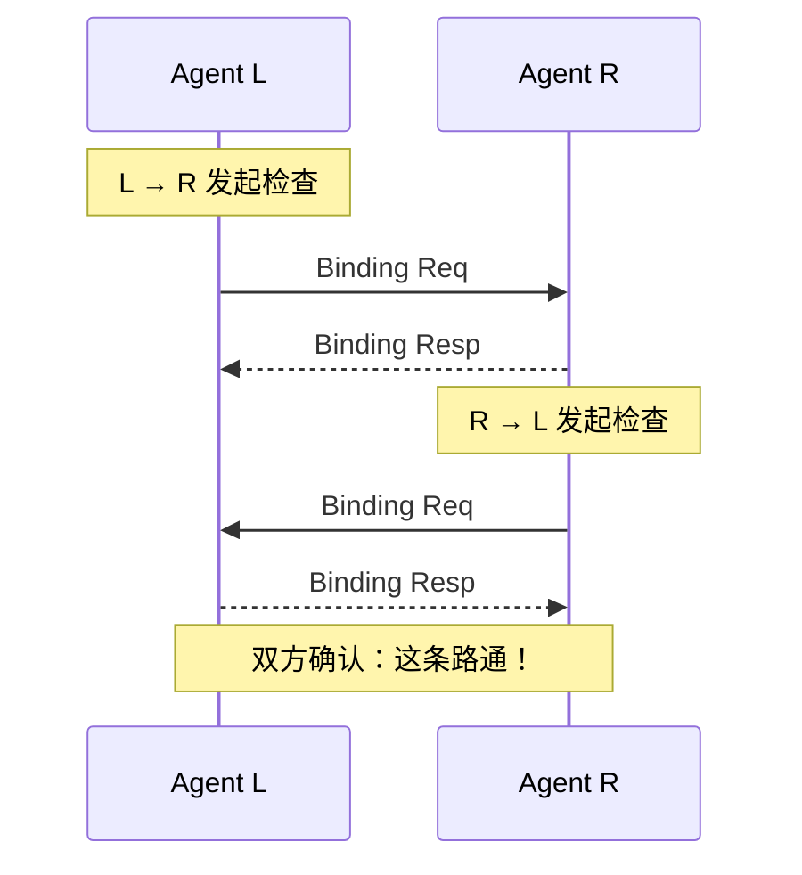
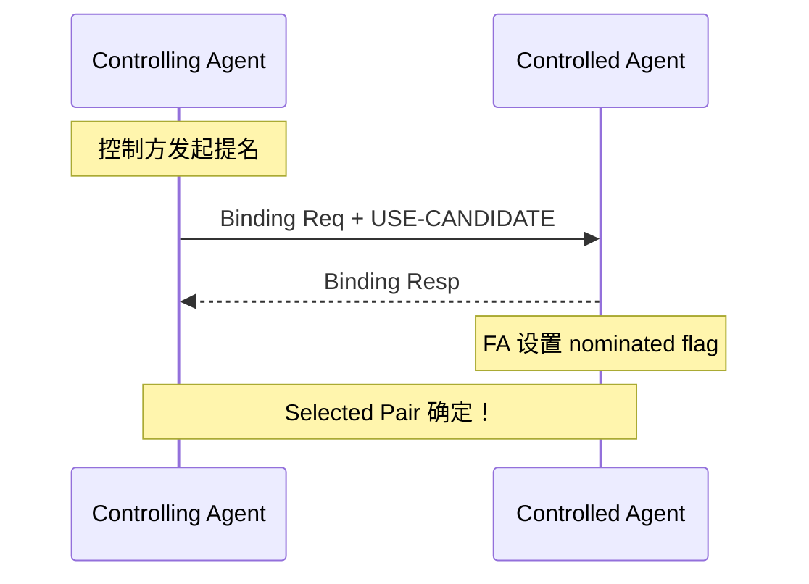
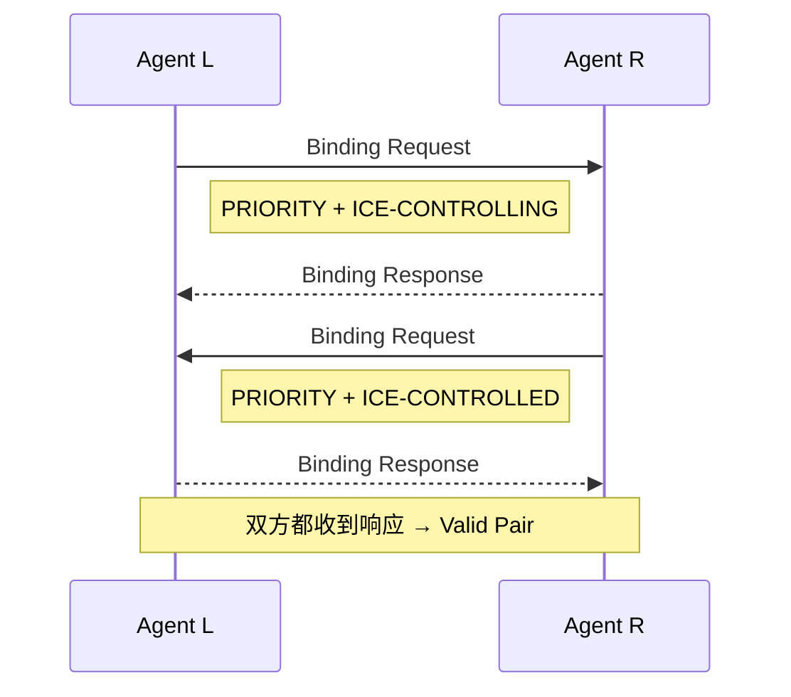
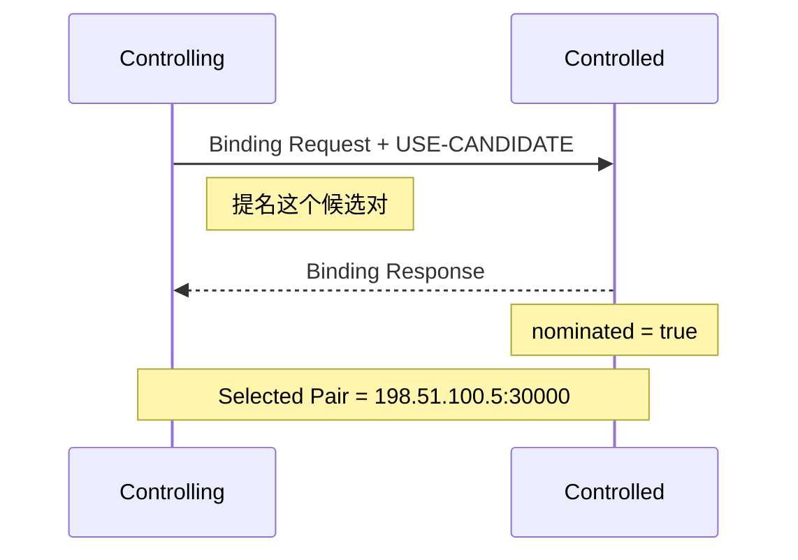
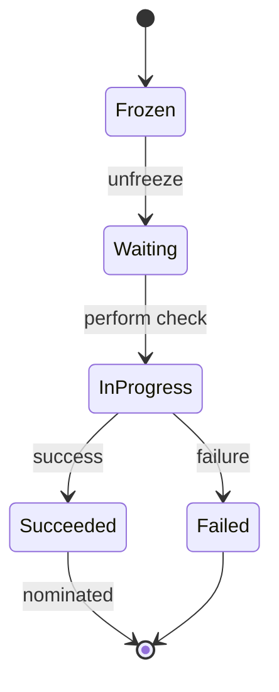

# ICE 连接性检查与提名 教程编写计划

> **For agentic workers:** Use superpowers:subagent-driven-development (recommended) or superpowers:executing-plans to implement this plan.

**Goal:** 创建 `tutorial-ice-connectivity-checks.md` 教程页面，详细解析 ICE 连接性检查 (Connectivity Checks) 和提名 (Nomination) 流程。

**Architecture:** 遵循现有 `tutorial-ice-candidate-gathering.md` 的格式：Mermaid 图表 + 分步骤描述 + 属性表。

**Tech Stack:** Markdown + Mermaid + Obsidian Wiki 格式

---

## 文件清单

### 新建文件
- `wiki/tutorials/tutorial-ice-connectivity-checks.md` - 主要教程页面

### 修改文件
- `wiki/concepts/concept-ice.md` - 添加指向新教程的链接
- `index.md` - 更新教程索引（如需要）

---

## Task 1: 创建 ICE 连接性检查与提名 教程页面

**Files:**
- Create: `wiki/tutorials/tutorial-ice-connectivity-checks.md`

### 内容大纲

```markdown
# ICE 连接性检查与提名详解

## 一句话理解
ICE 连接性检查 = 两端互相"敲门"验证通路 + 控制方"选定"最优路径

---

## 第一部分：连接性检查 (Connectivity Checks)

### 候选对 (Candidate Pair)

| 术语 | 说明 |
|------|------|
| Candidate Pair | 本地候选 + 远程候选的配对 |
| 本地候选 | 我方的候选地址 |
| 远程候选 | 对方的候选地址 |

示例：A 有 3 个候选，B 有 4 个候选 → 最多 12 个候选对

### STUN Binding 用于连接性检查

- [ ] 添加 STUN Binding Request 消息格式（带 PRIORITY 属性）
- [ ] 添加 ICE-CONTROLLING / ICE-CONTROLLED 属性说明
- [ ] 添加 USE-CANDIDATE 属性说明

### 4-way Handshake 详解



### Peer-Reflexive 发现

- [ ] 说明 Prflx 是在连接性检查时发现的
- [ ] 对端通过源 IP:Port 识别

### 候选对状态机

```mermaid
stateDiagram-v2
    [*] --> Frozen
    Frozen --> Waiting: unfreeze
    Waiting --> In-Progress: perform check
    In-Progress --> Succeeded: success
    In-Progress --> Failed: failure
    Succeeded --> [*]
    Failed --> [*]
```

### Checklist 和 Valid List

- [ ] 说明 Checklist 按优先级排序
- [ ] 说明 Valid List 记录通过检查的候选对

---

## 第二部分：提名 (Nomination)

### Regular Nomination vs Aggressive Nomination

| 类型 | RFC 5245 | RFC 8445 |
|------|----------|----------|
| Regular Nomination | 支持 | **支持** |
| Aggressive Nomination | 支持 | **已移除** |

### 提名流程图



### 提名后

- [ ] 说明 Selected Pair 的用途
- [ ] 说明保活机制：Binding Indication

---

## 第三部分：角色与决策

### Controlling vs Controlled Agent

| 角色 | 职责 |
|------|------|
| Controlling Agent | 负责提名候选对 |
| Controlled Agent | 等待控制方提名 |

### 角色冲突处理

- [ ] 说明 ICE-CONTROLLING / ICE-CONTROLLED 属性
- [ ] 说明 Tiebreaker 机制

---

## 第四部分：会话状态

### ICE 会话状态

| 状态 | 含义 |
|------|------|
| Running | ICE 正在进行中 |
| Completed | 找到可用路径 |
| Failed | 所有路径失败 |

---

## 一句话总结

> **连接性检查 = 4-way handshake 验证候选对**
>
> **提名 = 控制方用 USE-CANDIDATE 选择最优路径**
>
> **结果 = Selected Pair 用于媒体传输**

---

## 相关链接

- [[wiki/tutorials/tutorial-ice-candidate-gathering]] - 候选收集流程
- [[wiki/protocols/protocol-rfc8445]] - ICE RFC 8445 协议分析
```

---

### Task 1.1: 创建 Mermaid 图表 - 连接性检查 4-way Handshake



---

### Task 1.2: 创建 Mermaid 图表 - 提名流程



---

### Task 1.3: 创建 Mermaid 图表 - 候选对状态机



---

## Task 2: 更新 concept-ice.md 添加链接

**Files:**
- Modify: `wiki/concepts/concept-ice.md`

- [ ] 在"阶段二：连接检查"部分添加链接：
```markdown
**详细流程: [[wiki/tutorials/tutorial-ice-connectivity-checks]]**
```

---

## Task 3: 更新 index.md 索引

**Files:**
- Modify: `index.md`

- [ ] 在教程部分添加新页面：
```markdown
| [[wiki/tutorials/tutorial-ice-connectivity-checks]] | ICE 连接性检查与提名详解 | webrtc, ice, tutorial |
```

- [ ] 更新统计数字：Wiki 页面 9 → 10

---

## 自检清单

### 1. 内容覆盖检查

| 要求 | 状态 |
|------|------|
| 连接性检查 4-way handshake | ✅ |
| Peer-Reflexive 发现时机 | ✅ |
| 候选对状态机 | ✅ |
| Regular Nomination 流程 | ✅ |
| Controlling/Controlled 角色 | ✅ |
| ICE 会话状态 | ✅ |
| 与 RFC 5245 对比（Aggressive Nomination 移除）| ✅ |

### 2. 格式检查

- [ ] 所有图表使用 Mermaid，紧凑设计（不超出屏幕）
- [ ] 属性表清晰，包含 Type (Hex) 值
- [ ] 分步骤描述，每个步骤独立
- [ ] 包含相关链接

### 3. 类型一致性

- [ ] Message Type 使用十六进制：`0x0001`, `0x0101`
- [ ] 属性名使用大写：`PRIORITY`, `USE-CANDIDATE`
- [ ] 角色名称一致：`Controlling Agent` vs `Controlled Agent`

---

## 执行选项

**Plan complete and saved to `docs/superpowers/plans/2026-04-23-ice-connectivity-checks-nomination.md`**

Two execution options:

**1. Subagent-Driven (recommended)** - I dispatch a fresh subagent per task, review between tasks

**2. Inline Execution** - Execute tasks in this session using executing-plans

Which approach?
