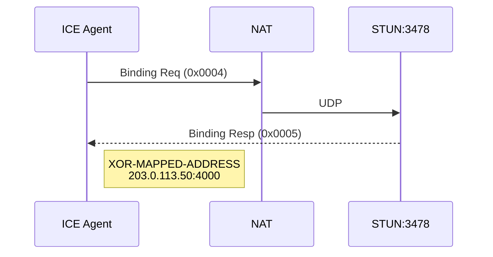
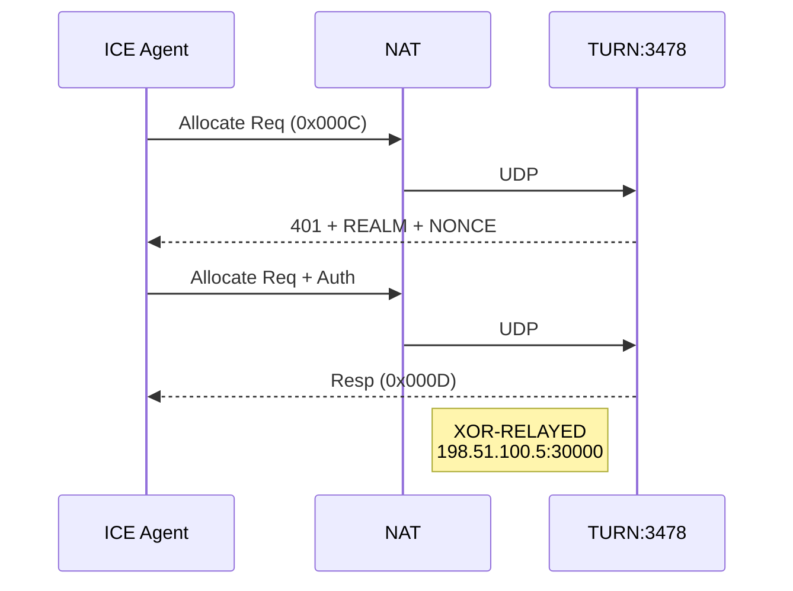
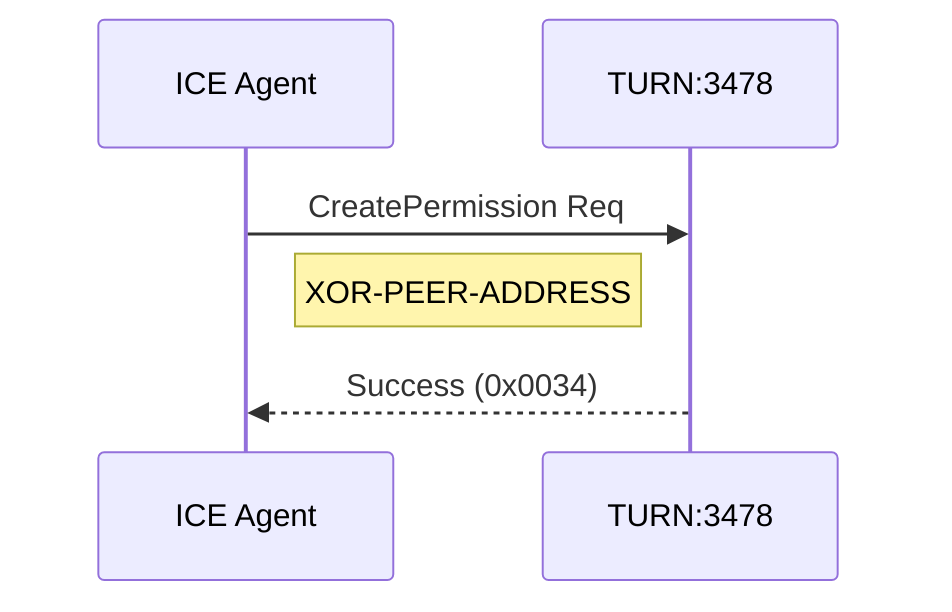
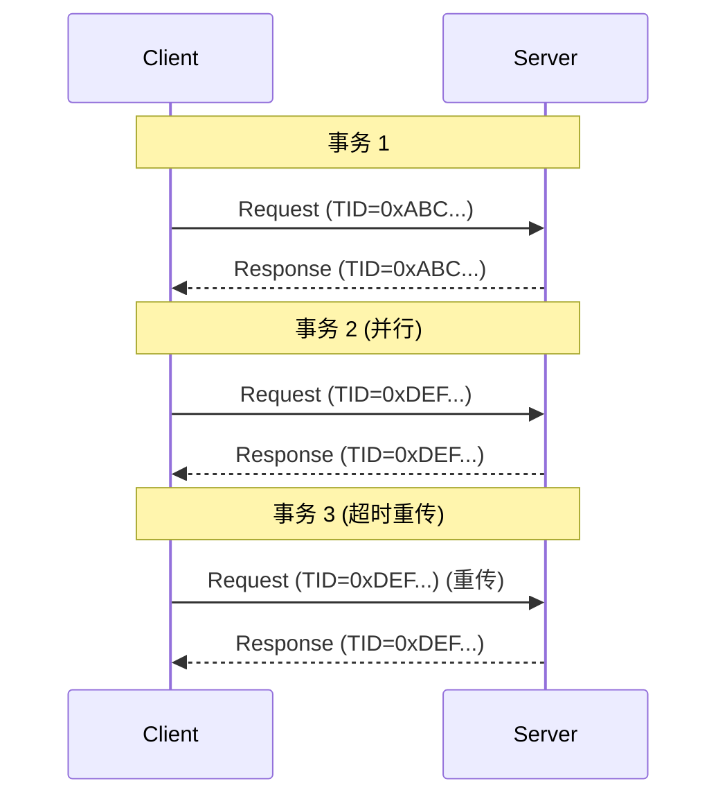
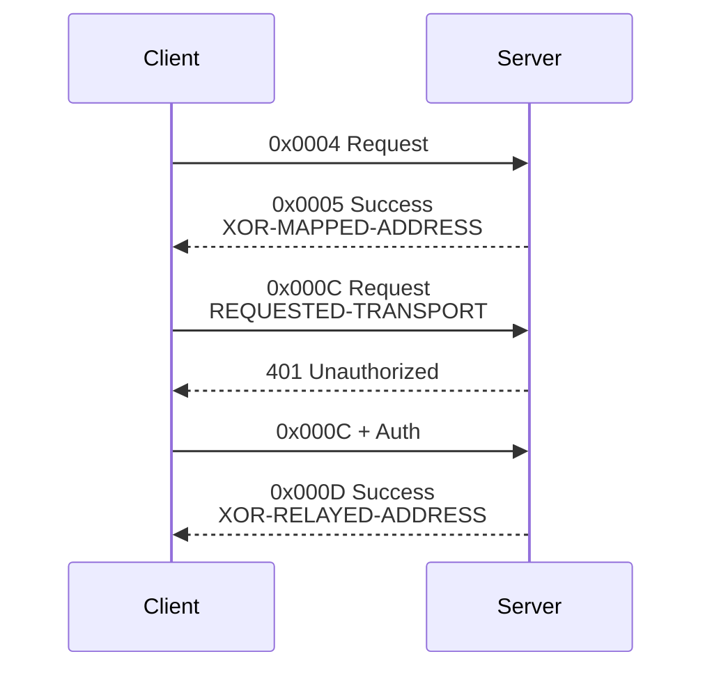

# ICE 候选收集流程详解

## 一句话理解

**ICE 候选收集 = 三步走：先拿本地地址 → 再问 STUN 要公网地址 → 最后问 TURN 要中继地址**

---

## 候选类型总览

| 候选类型      | 英文名              | 获取方式          | 协议   | 示例地址                 | 优先级      |
| --------- | ---------------- | ------------- | ---- | -------------------- | -------- |
| **Host**  | Host Candidate   | 绑定本地接口        | 无    | `192.168.1.100:5000` | 126 (最高) |
| **Srflx** | Server-Reflexive | STUN Binding  | STUN | `203.0.113.50:4000`  | 100      |
| **Prflx** | Peer-Reflexive   | 连接性检查发现       | STUN | `203.0.113.60:5000`  | 110      |
| **Relay** | Relayed          | TURN Allocate | TURN | `198.51.100.5:30000` | 0 (最低)   |

**优先级规则**：Host > Peer-Reflexive > Server-Reflexive > Relay

---

## Binding vs Allocate 对比

| 概念 | Binding | Allocate |
|------|---------|----------|
| **本质** | 查询 | 创建 |
| **位置** | NAT 设备 | TURN 服务器 |
| **对象** | NAT 映射表 | 服务器数据结构 |
| **类比** | 查快递柜地址 | 租一个快递柜 |
| **生命周期** | NAT 超时删除 | 可刷新续期 |

---

## 候选收集流程

### 步骤一：Host Candidates

直接绑定本机网络接口。

```
ICE Agent
├── eth0: 192.168.1.100:5000
├── wlan0: 10.0.0.50:5000
└── lo: 127.0.0.1:5001
```

### 步骤二：STUN Binding

**Binding 理解**：查询 NAT 分配的"绑定"

```
┌────────────────────────────────────────────────────────────────────┐
│                    NAT 设备                                         │
│                                                                    │
│   内部地址                绑定 (Binding)              公网地址        │
│   192.168.1.100:5000  ←────────────────────→  203.0.113.50:4000    │
│                                                                    │
│   本地主机                NAT 映射表                 外网看到的地址    │
└────────────────────────────────────────────────────────────────────┘

Binding = NAT 映射表中的那条记录
Binding Request = "请告诉我，当前 NAT 给我分配的绑定是什么？"
```



**Binding Request 数据包结构**：

| 偏移   | 字段             | 值                              | 说明                                                       |
| ---- | -------------- | ------------------------------ | -------------------------------------------------------- |
| 0-1  | Type           | `0000 0000 0000 0100` (0x0004) | Binding Request M=0x001, C=00 |
| 2-3  | Length         | `0x0000`                       | 无属性（或 `0x0008` 仅 FINGERPRINT）                            |
| 4-7  | Magic Cookie   | `0x2112A442`                   | 固定值                                                      |
| 8-19 | Transaction ID | 随机                             | 96-bit                                                   |
| 20+  | Attributes     | (可选)                           | FINGERPRINT                                              |

**Binding Response 数据包结构**：

| 偏移    | 字段                     | 值                              | 说明                                                       |
| ----- | ---------------------- | ------------------------------ | -------------------------------------------------------- |
| 0-1   | Type                   | `0000 0000 0000 0101` (0x0005) | Binding Success M=0x001, C=01 |
| 2-3   | Length                 | `0x0008`                       | XOR-MAPPED-ADDRESS 长度                                    |
| 4-7   | Magic Cookie           | `0x2112A442`                   | 固定值                                                      |
| 8-19  | Transaction ID         | 匹配请求                           | 96-bit                                                   |
| 20-27 | **XOR-MAPPED-ADDRESS** | -                              | 8 bytes                                                  |
|       | ├─ Type                | `0x0020`                       | 属性类型                                                     |
|       | ├─ Length              | `0x0008`                       | 长度                                                       |
|       | ├─ Family              | `0x01`                         | IPv4                                                     |
|       | ├─ Port                | `0x21B2`                       | 4000 XOR 0x2112                                          |
|       | └─ Address             | XOR 编码                         | 203.0.113.50 XOR 0x2112A442                              |

**结果**：获得 **Srflx Candidate** = `203.0.113.50:4000`

### 步骤三：TURN Allocate



**Allocate 理解**：在 TURN 服务器上创建"分配"

```
┌─────────────────────────────────────────────────────────────┐
│                    TURN 服务器                               │
│                                                             │
│   ┌─────────────────────────────────────────────────┐       │
│   │  Allocation (分配)                               │       │
│   │  ├─ Relayed Address: 198.51.100.5:30000         │       │
│   │  ├─ 5-tuple: 唯一标识                            │       │
│   │  ├─ Lifetime: 600 秒                            │       │
│   │  ├─ Permissions: 允许谁发数据                    │       │
│   │  └─ Channels: 通道绑定                           │       │
│   └─────────────────────────────────────────────────┘       │
│                                                             │
│   中继地址 ←────────────────────  ← 别人往这里发数据           │
│   198.51.100.5:30000           服务器转发给我                 │
└─────────────────────────────────────────────────────────────┘

Allocate = 在服务器上创建一个"信箱"数据结构
Allocate Request = "请在服务器上分配一个中继地址"
```

**Allocate Request 数据包结构**：

| 偏移   | 字段                     | Type                           | 说明                                                        |
| ---- | ---------------------- | ------------------------------ | --------------------------------------------------------- |
| 0-1  | Type                   | `0000 0000 0000 1100` (0x000C) | Allocate Request M=0x003, C=00 |
| 2-3  | Length                 | 可变                             | 属性总长度                                                     |
| 4-7  | Magic Cookie           | `0x2112A442`                   | 固定值                                                       |
| 8-19 | Transaction ID         | 随机                             | 96-bit                                                    |
| 20+  | Attributes             |                                |                                                           |
|      | ├─ REQUESTED-TRANSPORT | `0x0019`                       | 请求 UDP                                                    |
|      | ├─ USERNAME            | `0x0006`                       | 用户名                                                       |
|      | ├─ REALM               | `0x0014`                       | 认证领域                                                      |
|      | ├─ NONCE               | `0x0015`                       | 防重放随机数                                                    |
|      | └─ MESSAGE-INTEGRITY   | `0x0008`                       | HMAC-SHA1                                                 |

**Allocate Success Response 数据包结构**：

| 偏移   | 字段                         | Type                           | 说明                                                        |
| ---- | -------------------------- | ------------------------------ | --------------------------------------------------------- |
| 0-1  | Type                       | `0000 0000 0000 1101` (0x000D) | Allocate Success M=0x003, C=01 |
| 2-3  | Length                     | 可变                             | 属性总长度                                                     |
| 4-7  | Magic Cookie               | `0x2112A442`                   | 固定值                                                       |
| 8-19 | Transaction ID             | 匹配请求                           | 96-bit                                                    |
| 20+  | Attributes                 |                                |                                                           |
|      | ├─ **XOR-RELAYED-ADDRESS** | `0x0016`                       | 中继地址                                                      |
|      | ├─ **XOR-MAPPED-ADDRESS**  | `0x0020`                       | 反射地址                                                      |
|      | ├─ LIFETIME                | `0x000D`                       | 600 秒                                                     |
|      | └─ MESSAGE-INTEGRITY       | `0x0008`                       | HMAC-SHA1                                                 |

**结果**：获得 **Relay Candidate** = `198.51.100.5:30000`

### TURN 授权流程详解

TURN 服务器是**付费资源**，需要身份验证才能使用，防止资源滥用。

#### 为什么需要授权？

| 对比 | STUN | TURN |
|------|------|------|
| **资源类型** | 公开查询 | 付费中继 |
| **带宽消耗** | 无 | 所有数据流经服务器 |
| **使用成本** | 免费 | 服务器/带宽费用 |
| **攻击风险** | 低 | 高（可被用于匿名攻击） |

#### 完整授权流程

```
┌─────────────────────────────────────────────────────────────┐
│                     TURN 授权流程                            │
├─────────────────────────────────────────────────────────────┤
│                                                             │
│  1. 首次请求 (无凭证)                                         │
│     客户端 ──── Allocate Request ────▶ 服务器                 │
│           (无任何认证信息)              │                     │
│     ◀──────── 401 Unauthorized ────────┘                    │
│          + REALM + NONCE                                    │
│          │                                                  │
│  2. 重新请求 (带凭证)                                         │
│     客户端 ──── Allocate Request ────▶ 服务器                 │
│           + USERNAME                                        │
│           + REALM                                           │
│           + NONCE                                           │
│           + MESSAGE-INTEGRITY (HMAC-SHA1 签名)               │
│                                    │                        │
│     ◀──────── 200 OK ─────────────────┘                     │
│          + XOR-RELAYED-ADDRESS                              │
│                                                             │
└─────────────────────────────────────────────────────────────┘
```

#### 授权字段说明

| 字段 | 作用 | 说明 |
|------|------|------|
| **REALM** | 认证领域 | 告诉客户端使用哪个账号系统 |
| **NONCE** | 防重放随机数 | 服务器生成的随机数，客户端原样返回 |
| **USERNAME** | 用户身份 | 用户名标识 |
| **MESSAGE-INTEGRITY** | 消息签名 | HMAC-SHA1(密码, 完整消息)，证明持有正确密码 |

#### 安全保证

| 威胁 | 防御机制 |
|------|----------|
| **窃听** | MESSAGE-INTEGRITY 用密码签名，数据被篡改可检测 |
| **重放攻击** | NONCE 每次不同，复用旧请求会被拒绝 |
| **篡改** | 签名覆盖整个消息，修改后签名不匹配 |
| **资源滥用** | 需要有效账号，防止免费搭车 |

#### 一句话总结

> **TURN 授权 = 防止免费搭车 + 追踪恶意用户 + 保护付费资源**

### Allocate Request vs Allocate Auth 数据格式对比

#### 请求一：首次请求（无认证）

```
┌─────────────────────────────────────────────────────────────┐
│  偏移   字段              值                                 │
├─────────────────────────────────────────────────────────────┤
│  0-1   Type              0x000C (Allocate Request)          │
│  2-3   Length            属性总长度                          │
│  4-7   Magic Cookie      0x2112A442                         │
│  8-19  Transaction ID    随机数                              │
│  20+   Attributes:                                          │
│         ├─ REQUESTED-TRANSPORT (0x0019) ←── 必选            │
│         └─ (无其他属性)                                      │
└─────────────────────────────────────────────────────────────┘
```

#### 请求二：带认证（携带凭证）

```
┌─────────────────────────────────────────────────────────────┐
│  偏移   字段              值                                  │
├─────────────────────────────────────────────────────────────┤
│  0-1   Type              0x000C (Allocate Request)          │
│  2-3   Length            属性总长度 (增大)                    │
│  4-7   Magic Cookie      0x2112A442                         │
│  8-19  Transaction ID    新随机数                            │
│  20+   Attributes:                                          │
│         ├─ REQUESTED-TRANSPORT (0x0019) ←── 必选             │
│         ├─ USERNAME (0x0006)        ←── 新增                 │
│         ├─ REALM (0x0014)           ←── 新增                 │
│         ├─ NONCE (0x0015)           ←── 新增                 │
│         └─ MESSAGE-INTEGRITY (0x0008) ←── 新增               │
└─────────────────────────────────────────────────────────────┘
```

#### 核心区别对比

| 字段 | 无认证 | 带认证 |
|------|--------|--------|
| **Type** | `0x000C` | `0x000C` (不变) |
| **Length** | 小 | 大 (增加了 4 个属性) |
| **Transaction ID** | 随机 | 新随机数 |
| **REQUESTED-TRANSPORT** | ✅ | ✅ |
| **USERNAME** | ❌ | ✅ 新增 |
| **REALM** | ❌ | ✅ 新增 |
| **NONCE** | ❌ | ✅ 新增 |
| **MESSAGE-INTEGRITY** | ❌ | ✅ 新增 |

#### MESSAGE-INTEGRITY 计算方式

```
签名范围 = 从 Message Type 到最后一个属性（不含 MESSAGE-INTEGRITY 自身）

签名内容:
  Type + Length + Magic Cookie + Transaction ID + 所有 Attributes
  (不含 MESSAGE-INTEGRITY)

签名值 = HMAC-SHA1(密码, 签名内容)
```

#### Transaction ID 为什么要更新？

| 步骤 | Transaction ID | NONCE |
|------|---------------|-------|
| 首次请求 | `0xABC...` | 无 |
| 服务器返回 401 | - | `0x123...` (新生成) |
| 带认证请求 | `0xDEF...` (新生成) | `0x123...` (原样返回) |

**原因**：复用旧 Transaction ID 会被服务器认为是重放攻击，直接拒绝。

#### 一句话总结

> **核心区别**：带认证版本多了 4 个属性（USERNAME/REALM/NONCE/MESSAGE-INTEGRITY），Type 不变但 Length 增大。

### 步骤四：CreatePermission



---

## 候选收集结果

| Type | Address | Priority | Foundation |
|------|---------|----------|------------|
| Host | 192.168.1.100:5000 | 126 | 1 |
| Host | 10.0.0.50:5000 | 126 | 2 |
| Host | 127.0.0.1:5001 | 126 | 3 |
| Srflx | 203.0.113.50:4000 | 100 | 4 |
| Relay | 198.51.100.5:30000 | 0 | 5 |

**优先级**：Host > Peer-Reflexive > Server-Reflexive > Relay

### Foundation 详解

**Foundation** = 候选的"血缘标签"，用于标识候选对是否走同一条物理网络路径。

#### 作用：避免重复检查

相同 Foundation 的候选对，走的是同一条网络路径，只需验证一次连通性即可。

```
ICE Agent                            对端
    │                                 │
    │── 检查 Host↔Srflx ──────────────▶│  (检查 Foundation=1)
    │◀── 连通！ ──────────────────-─-──│
    │                                 │
    │✗ 跳过 Host↔Srflx (同 Foundatioasdn) │  (已验证，无需再试)
    │✗ 跳过 Host↔Srflx (同 Foundation) │
```

#### Foundation 的计算规则

```
Foundation = 候选类型 + 底层 IP 地址 (Base IP)
```

| 影响因素 | 说明 |
|----------|------|
| **Base IP** | 候选的底层 IP（Host 候选的本地 IP，或 Srflx 候选的 NAT 公网 IP） |
| **候选类型** | Host/Srflx/Relay 三种类型独立计算 |

#### 计算示例

```
场景: 主机有两个网卡，同一个 NAT 后面有两个 STUN 服务器

候选 1: Host (192.168.1.100:5000)
  Base IP: 192.168.1.100
  Foundation: "1-HOST-192.168.1.100"

候选 2: Host (10.0.0.50:5000)
  Base IP: 10.0.0.50 (不同网卡)
  Foundation: "2-HOST-10.0.0.50"

候选 3: Srflx (203.0.113.50:4000)
  Base IP: 203.0.113.50 (NAT 公网 IP)
  Foundation: "3-SRFLX-203.0.113.50"
```

#### 同 Foundation vs 不同 Foundation

| 候选对 | Foundation | 是否需要检查 |
|--------|------------|-------------|
| Host₁ ↔ Host₂ | 不同 | ✅ 检查（不同网络接口） |
| Host ↔ Srflx | 相同 | ❌ 跳过（同物理路径） |
| Srflx₁ ↔ Srflx₂ | 不同 | ✅ 检查（不同 NAT） |
| Host ↔ Relay | 不同 | ✅ 检查（Relay 单独计算） |

#### 为什么要避免重复检查？

```
不优化检查次数:
  4 个候选 → 最多 4×4 = 16 对需要检查

优化后 (同 Foundation 跳过):
  同一 Foundation 只检查一次
  → 大幅减少检查次数，加快连接建立
```

---

## STUN 协议详解

### 消息格式

```
┌─────────────────────────────────────────────────────────┐
│  STUN 头 (20 字节)                                       │
├─────────────────────────────────────────────────────────┤
│  | 类型 (16bit) | 长度 (16bit) |   Magic Cookie (32bit)  │
│  |              Transaction ID (96bit)                  │
├─────────────────────────────────────────────────────────┤
│  属性 1 (TLV)                                            │
├─────────────────────────────────────────────────────────┤
│  属性 2 (TLV)                                            │
├─────────────────────────────────────────────────────────┤
│  ...                                                    │
└─────────────────────────────────────────────────────────┘
```

### 头部结构详解

```
 0                   1                   2                   3
 0 1 2 3 4 5 6 7 8 9 0 1 2 3 4 5 6 7 8 9 0 1 2 3 4 5 6 7 8 9 0 1
+-+-+-+-+-+-+-+-+-+-+-+-+-+-+-+-+-+-+-+-+-+-+-+-+-+-+-+-+-+-+-+-+
|0 0|     STUN Message Type     |         Message Length        |
+-+-+-+-+-+-+-+-+-+-+-+-+-+-+-+-+-+-+-+-+-+-+-+-+-+-+-+-+-+-+-+-+
|                         Magic Cookie (0x2112A442)             |
+-+-+-+-+-+-+-+-+-+-+-+-+-+-+-+-+-+-+-+-+-+-+-+-+-+-+-+-+-+-+-+-+
|                                                               |
|                     Transaction ID (96 bits)                  |
|                                                               |
+-+-+-+-+-+-+-+-+-+-+-+-+-+-+-+-+-+-+-+-+-+-+-+-+-+-+-+-+-+-+-+-+
```

**关键字段说明：**
- **前 2 位必须为 0**：用于区分 STUN 和其他协议
- **Magic Cookie (0x2112A442)**：固定值，用于协议识别和 XOR 混淆
- **Transaction ID**：96 位随机数，用于关联请求和响应

### Magic Cookie 详解

Magic Cookie (`0x2112A442`) 是 RFC 5389 规定的固定值，有两个核心作用：

#### 作用一：协议识别

STUN 运行在 UDP/TCP 上，和 RTP、RTCP、DTLS 等协议共用同一端口。Magic Cookie 用于区分 STUN 和其他协议：

```
收到 UDP 包
    │
    ▼
检查前 4 字节是否为 0x2112A442？
    │
    ├─ 是 → 认为是 STUN 消息
    └─ 否 → 不是 STUN，交给其他协议
```

#### 作用二：XOR 编码

用于混淆 `XOR-MAPPED-ADDRESS` 等地址字段，防止 NAT ALG 误改：

| 问题 | NAT/防火墙有 ALG（应用层网关）功能，会检查 UDP 包中的 IP 地址并"帮忙"转换 |
|------|--------------------------------------------------------------------------------|
| 解决 | XOR 编码将地址变成"乱码"，ALG 看到随机数以为普通数据，不会误改 |

```
原始地址: 203.0.113.50
XOR 密钥: 0x2112A442
编码后:   看起来像随机数

服务器解码: 随机数 XOR 0x2112A442 = 原始地址
```

#### 为什么必须是 4 字节？

XOR 操作要求参与的两个值位数相同：

| 数据 | 长度 | Magic Cookie 使用方式 |
|------|------|---------------------|
| IPv4 地址 | 4 bytes (32 bits) | 用全部 4 bytes XOR |
| IPv6 地址 | 16 bytes | 用 4 bytes 重复 XOR |
| Port | 2 bytes | 只用高 2 bytes (0x2112) XOR |

```
示例：Port = 4000 (0x0FA0)
0x0FA0 XOR 0x2112 = 0x21B2
```

---

## Transaction ID 详解

### 什么是 Transaction ID？

Transaction ID（事务 ID）是 STUN 消息中用于**匹配请求和响应**的 96 位（12 字节）随机数。

```
┌─────────────────────────────────────────────────────────────┐
│                    STUN 头部结构                             │
├─────────────────────────────────────────────────────────────┤
│  | 类型 (16bit) | 长度 (16bit) |   Magic Cookie (32bit)      │
│  |              Transaction ID (96bit)                      │
└─────────────────────────────────────────────────────────────┘

Transaction ID = 12 字节随机数
```

### 为什么是 96 位？

| 特性 | 说明 |
|------|------|
| **长度** | 96 bits = 12 bytes |
| **随机性** | 每次请求生成新的随机数 |
| **唯一性** | 足够大，确保同一时间不同事务不冲突 |
| **抗碰撞** | 96 位空间使碰撞概率极低 |

```
96 位随机数空间：2^96 ≈ 7.9 × 10^28
如果每秒发送 100 万个请求，需要 10^16 年才会出现碰撞
```

### Transaction ID 的作用

**核心作用**：将响应与请求一一对应

```
Client                          Server
  │                                │
  │──── Binding Req ──────────────▶│  Transaction ID: 0xABC...
  │     (Transaction ID: 随机)     │
  │                                │
  │◀─── Binding Resp ─────────────│  Transaction ID: 0xABC... (必须相同!)
  │     (必须匹配请求的 ID)         │
```

### 匹配规则

| 规则 | 说明 |
|------|------|
| **响应必须匹配** | Success/Error Response 的 Transaction ID 必须与对应请求完全相同 |
| **独立事务** | 每个请求-响应对使用独立的 Transaction ID |
| **不重用** | 同一客户端不应在短时间内重用相同的 Transaction ID |

### 实际抓包示例

```
STUN Binding Request:
  Type:         0x0004 (Binding Request)
  Length:       0x0000
  Magic Cookie: 0x2112A442
  Transaction:  01 23 45 67 89 AB CD EF 12 34 56 78

STUN Binding Response:
  Type:         0x0005 (Binding Success)
  Length:       0x0014
  Magic Cookie:  0x2112A442
  Transaction:  01 23 45 67 89 AB CD EF 12 34 56 78  ← 必须匹配!
```

### Transaction ID vs Magic Cookie

| 特性 | Magic Cookie | Transaction ID |
|------|-------------|----------------|
| **长度** | 32 bits (4 bytes) | 96 bits (12 bytes) |
| **值** | 固定 `0x2112A442` | 随机生成 |
| **用途** | 协议识别 + XOR 混淆 | 请求-响应对应 |
| **位置** | 固定偏移 4-7 | 固定偏移 8-19 |

### 请求-响应流程



### 与 TCP/UDP 的关系

| 传输层 | Transaction ID 用途 |
|--------|---------------------|
| **UDP** | 必需。因为 UDP 无连接，Transaction ID 是匹配响应的唯一方式 |
| **TCP** | 可选。因为 TCP 有序列号，但 STUN 仍使用 Transaction ID 保持一致性 |

### 防重放攻击

96 位 Transaction ID 的随机性使其难以预测：

```
攻击者尝试:
  1. 拦截请求  → 无法预测 Transaction ID
  2. 伪造响应 → 不知道正确的 Transaction ID
  3. 重放旧响应 → Transaction ID 已过期

防御:
  - 服务器记录最近的 Transaction ID
  - 拒绝重复的 Transaction ID
```

---

## STUN Message Type Flag 详解

### M 和 C 的含义

在 STUN 协议中，Message Type 使用 **M** 和 **C** 两个字母来区分不同的概念：

| 字母 | 全称 | 含义 | 类比 |
|------|------|------|------|
| **M** | Method | "方法" = **做什么操作** | 动作：吃饭、睡觉、走路 |
| **C** | Class | "类别" = **消息的角色** | 语气：请求、肯定、否定 |

```
┌─────────────────────────────────────────────────────────────┐
│                     一句话理解                               │
├─────────────────────────────────────────────────────────────┤
│  M = 做什么事？（查询？分配？刷新？）                            │
│  C = 这是什么角色？（请求？成功？失败？）                        │
└─────────────────────────────────────────────────────────────┘
```

### M 和 C 的组合

STUN Message Type 是 16 位，由两部分组成：

```
  16bit = [M11 M10 ... M1 M0 | C1 C0]
           ←──── 12 位 ────→  ↑↑
           方法 (Method)       类别 (Class)
           必须是 0    必须全为 0 → Request
```

| 组成部分       | 位数      | 作用  | 说明          |
| ---------- | ------- | --- | ----------- |
| **M11-M0** | 12 bits | 方法  | "要执行什么操作"   |
| **C1-C0**  | 2 bits  | 类别  | "这个消息是干什么的" |

**注意**：在 STUN 协议中，Method 的最高位 (M11) **必须为 0**，这意味着实际可用的 Method 值范围受限。

### M = Method（方法）

**Method** 表示"要执行什么操作"，类似 HTTP 的 GET/POST：

| Method | 值 | 说明 | 场景 |
|--------|-----|------|------|
| **Binding** | 1 | 查询绑定 | "请告诉我 NAT 给我分配的公网地址" |
| **Allocate** | 3 | 分配中继 | "请给我分配一个 TURN 中继地址" |
| **Refresh** | 9 | 刷新分配 | "延长我的中继地址有效期" |
| **CreatePermission** | 13 | 创建权限 | "允许某个 IP 发数据给我" |

### C = Class（类别）

**Class** 表示"这个消息是干什么的"，类似 HTTP 的 Request/Response：

| C1 | C0 | 类别值 | 含义 | 说明 |
|----|----|--------|------|------|
| 0 | 0 | `00` | **Request (请求)** | 客户端说："我要做某事" |
| 0 | 1 | `01` | **Success (成功)** | 服务器说："做成了！" |
| 1 | 0 | `10` | **Indication (指示)** | 单向消息："给你个通知" |
| 1 | 1 | `11` | **Error (错误)** | 服务器说："出错了！" |

### M 和 C 组合示例

**Type 结构**：`[Reserved (2 bits=00)] [Method (12 bits)] [Class (2 bits)]`

```
  16bit:  [00][M11 M10 ... M1 M0][C1 C0]
           ↑↑  ←─── 12 bits ────→   2 bits
         预留位   方法 (Method)    类别 (Class)
```

| Type | 二进制 (16 bits) | M (方法) | C (类别) | 含义 |
|------|-----------------|---------|----------|------|
| `0x0004` | `0000 0000 0000 0100` | Binding (0x001) | Request (`00`) | "请求执行绑定查询" |
| `0x0011` | `0000 0000 0000 1010` | Binding (0x001) | Indication (`10`) | "绑定通知" |
| `0x0005` | `0000 0000 0000 0101` | Binding (0x001) | Success (`01`) | "绑定查询成功" |
| `0x0007` | `0000 0000 0000 0111` | Binding (0x001) | Error (`11`) | "绑定查询失败" |
| `0x000C` | `0000 0000 0000 1100` | Allocate (0x003) | Request (`00`) | "请求分配中继地址" |
| `0x000D` | `0000 0000 0000 1101` | Allocate (0x003) | Success (`01`) | "分配成功" |
| `0x000F` | `0000 0000 0000 1111` | Allocate (0x003) | Error (`11`) | "分配失败" |

### M 和 C 的生活类比

```
点餐场景:
  M = 点什么？（方法）
  C = 怎么说的？（类别）

  M=牛排, C=请求 → "请给我来一份牛排" (Request)
  M=牛排, C=确认 → "好的，牛排马上来" (Success)
  M=牛排, C=拒绝 → "抱歉，牛排卖完了" (Error)

STUN 场景:
  M = 执行什么操作？（方法）
  C = 什么角色？（类别）

  M=Binding, C=Request → "请查询我的 NAT 绑定" (Request)
  M=Binding, C=Success → "查询成功，地址是..." (Success)
  M=Binding, C=Error   → "查询失败，原因是..." (Error)
```

---

### Message Type 字段完整结构

STUN 消息的 16 位 Type 字段结构如下：

```
┌─────────────────────────────────────────────────────┐
│  16bit = [方法 12bit] [C1 1bit] [C0 1bit]            │
├─────────────────────────────────────────────────────┤
│  C1 C0: 00=请求, 01=成功响应, 10=指示, 11=错误         │
└─────────────────────────────────────────────────────┘
```

### Message Type 位字段详解

STUN 消息的 16 位 Type 字段结构如下：

```
 0                   1                   2                   3
 0 1 2 3 4 5 6 7 8 9 0 1 2 3 4 5 6 7 8 9 0 1 2 3 4 5 6 7 8 9 0 1
+-+-+-+-+-+-+-+-+-+-+-+-+-+-+-+-+-+-+-+-+-+-+-+-+-+-+-+-+-+-+-+-+
|M11|M10| M9| M8| M7| M6| M5| M4| M3| M2| M1| M0|  C1 |  C0 |
+-+-+-+-+-+-+-+-+-+-+-+-+-+-+-+-+-+-+-+-+-+-+-+-+-+-+-+-+-+-+-+-+
←─────────────── 方法 (Method) 12 bits ──────────────→ ←类别→

Byte 0: [M11 M10 M9 M8 M7 M6 M5 M4]
Byte 1: [M3  M2  M1  M0  0   0   C1  C0 ]
```

| 位字段 | 位置 (bit) | 位数 | 说明 |
|--------|------------|------|------|
| **M11** | bit 15 | 1 | 方法位 11 (最高位) |
| **M10** | bit 14 | 1 | 方法位 10 |
| **M9** | bit 13 | 1 | 方法位 9 |
| **M8** | bit 12 | 1 | 方法位 8 |
| **M7** | bit 11 | 1 | 方法位 7 |
| **M6** | bit 10 | 1 | 方法位 6 |
| **M5** | bit 9 | 1 | 方法位 5 |
| **M4** | bit 8 | 1 | 方法位 4 |
| **M3** | bit 7 | 1 | 方法位 3 |
| **M2** | bit 6 | 1 | 方法位 2 |
| **M1** | bit 5 | 1 | 方法位 1 |
| **M0** | bit 4 | 1 | 方法位 0 (最低位) |
| **C1** | bit 1 | 1 | 类别位 1 |
| **C0** | bit 0 | 1 | 类别位 0 |

### C0-C1 类别 (Class) 详解

**C1-C0** 两位表示消息的类别，决定消息的角色：

| C1 | C0 | 类别值 | 含义 | 说明 |
|----|----|--------|------|------|
| 0 | 0 | `00` | **请求 (Request)** | 客户端发起，需要服务器响应 |
| 0 | 1 | `01` | **成功响应 (Success Response)** | 服务器返回的成功结果 |
| 1 | 0 | `10` | **指示 (Indication)** | 单向消息，无需响应 |
| 1 | 1 | `11` | **错误响应 (Error Response)** | 服务器返回的错误 |

```
┌──────────────────────────────────────────────────────────────┐
│                    C1-C0 类别编码表                           │
├──────────────────────────────────────────────────────────────┤
│  C1=0, C0=0 → 00 → Request (请求)                            │
│              例: Binding Request (0x0004)                    │
├──────────────────────────────────────────────────────────────┤
│  C1=0, C0=1 → 01 → Success Response (成功响应)                │
│              例: Binding Success (0x0005)                    │
├──────────────────────────────────────────────────────────────┤
│  C1=1, C0=0 → 10 → Indication (指示/单向)                     │
│              例: Binding Indication (0x0006)                 │
├──────────────────────────────────────────────────────────────┤
│  C1=1, C0=1 → 11 → Error Response (错误响应)                  │
│              例: Binding Error (0x0007)                      │
└──────────────────────────────────────────────────────────────┘
```

### M0-M11 方法 (Method) 详解

**M0-M11** 是 12 位方法字段，表示具体的操作类型。方法值由 12 个位的组合计算得出：

```
方法值 = M0×2⁰ + M1×2¹ + M2×2² + M3×2³ + M4×2⁴ + M5×2⁵ 
       + M6×2⁶ + M7×2⁷ + M8×2⁸ + M9×2⁹ + M10×2¹⁰ + M11×2¹¹
```

**常用 STUN/TURN 方法速查：**

| 方法名                  | M11-M0 二进制       | M11-M0 十六进制 | 值   | 说明        |
| -------------------- | ---------------- | ----------- | --- | --------- |
| **Binding**          | `0000 0000 0001` | `0x001`     | 1   | 查询 NAT 映射 |
| **Allocate**         | `0000 0000 0011` | `0x003`     | 3   | TURN 分配中继 |
| **Refresh**          | `0000 0000 1001` | `0x009`     | 9   | 刷新分配      |
| **CreatePermission** | `0000 0000 1101` | `0x00D`     | 13  | 创建权限      |
| **Send**             | `0000 0001 0000` | `0x00E`     | 14  | 发送数据      |
| **Data**             | `0000 0001 0010` | `0x010`     | 16  | 接收数据      |
| **ChannelBind**      | `0000 0001 0011` | `0x011`     | 17  | 通道绑定      |

### Type 字段分解示例

**示例 1: Binding Request (0x0004)**

```
Type = 0x0004 = 0b 0000 0000 0000 0100

┌─────────────────────────────────────────────────────────────┐
│  二进制分解: 0000 0000 0000 0100                              │
│                                                             │
│  计算: Type = (Method << 2) | Class                          │
│       0x0004 = (0x001 << 2) | 0x00                          │
│                                                             │
│  Method = 0x001 (Binding)                                   │
│  Class = 0x00 (Request)                                     │
└─────────────────────────────────────────────────────────────┘

含义: "执行 Binding 方法的请求"
```

**示例 2: Binding Success (0x0005)**

```
Type = 0x0005 = 0b 0000 0000 0000 0101

┌─────────────────────────────────────────────────────────────┐
│  二进制分解: 0000 0000 0000 0101                             │
│                                                             │
│  计算: Type = (Method << 2) | Class                         │
│       0x0005 = (0x001 << 2) | 0x01                          │
│                                                             │
│  Method = 0x001 (Binding)                                   │
│  Class = 0x01 (Success)                                     │
└─────────────────────────────────────────────────────────────┘

含义: "Binding 方法的成功响应"
```

**示例 3: Allocate Request (0x000C)**

```
Type = 0x000C = 0b 0000 0000 0000 1100

┌─────────────────────────────────────────────────────────────┐
│  二进制分解: 0000 0000 0000 1100                              │
│                                                             │
│  计算: Type = (Method << 2) | Class                          │
│       0x000C = (0x003 << 2) | 0x00                          │
│                                                             │
│  Method = 0x003 (Allocate)                                  │
│  Class = 0x00 (Request)                                     │
└─────────────────────────────────────────────────────────────┘

含义: "执行 Allocate 方法的请求"
```

### 完整消息类型对照表

**Type 计算公式**：`Type = (Method << 2) | (C1 << 1) | C0`

| 消息                       | Type     | M (十六进制) | C (二进制) | 含义                          |
| ------------------------ | -------- | -------- | ------- | --------------------------- |
| **Binding Request**      | `0x0004` | `0x001`  | `00`    | M=1(Binding), C=00(请求)      |
| **Binding Indication**   | `0x0006` | `0x001`  | `10`    | M=1(Binding), C=10(指示)      |
| **Binding Success**      | `0x0005` | `0x001`  | `01`    | M=1(Binding), C=01(成功)      |
| **Binding Error**        | `0x0007` | `0x001`  | `11`    | M=1(Binding), C=11(错误)      |
| **Allocate Request**     | `0x000C` | `0x003`  | `00`    | M=3(Allocate), C=00(请求)     |
| **Allocate Indication**  | `0x000E` | `0x003`  | `10`    | M=3(Allocate), C=10(指示)     |
| **Allocate Success**     | `0x000D` | `0x003`  | `01`    | M=3(Allocate), C=01(成功)     |
| **Allocate Error**       | `0x000F` | `0x003`  | `11`    | M=3(Allocate), C=11(错误)     |
| **Refresh Request**      | `0x0024` | `0x009`  | `00`    | M=9(Refresh), C=00(请求)      |
| **Refresh Success**      | `0x0025` | `0x009`  | `01`    | M=9(Refresh), C=01(成功)      |
| **CreatePermission Req** | `0x0034` | `0x00D`  | `00`    | M=13(CreatePerm), C=00      |
| **ChannelBind Request**  | `0x002C` | `0x00B`  | `00`    | M=11(ChannelBind), C=00(请求) |

### Flag 变化流程图

```
┌──────────────────────────────────────────────────────────────┐
│                   完整 Type 计算公式                           │
├──────────────────────────────────────────────────────────────┤
│  Type = (Method << 2) | (C1 << 1) | C0                       │
│                                                              │
│  其中:                                                       │
│    Method = M11..M0 (12 位方法值)                             │
│    C1 = 0 或 1 (类别位 1)                                     │
│    C0 = 0 或 1 (类别位 0)                                     │
└──────────────────────────────────────────────────────────────┘

┌──────────────────────────────────────────────────────────────┐
│                   STUN 消息生命周期                            │
├──────────────────────────────────────────────────────────────┤
│                                                              │
│  Client                    Server                            │
│    │                          │                              │
│    │──── 0x0004 Request ─────▶│  C1=0, C0=0                  │
│    │◀─── 0x0005 Success ───────│  C1=0, C0=1                 │
│    │      (XOR-MAPPED-ADDRESS)│                              │
│    │                          │                              │
│    │──── 0x000C Request ─────▶│  认证请求                     │
│    │◀─── 0x000F Error ────────│  需要认证                     │
│    │──── 0x000C + Auth ──────▶│                              │
│    │◀─── 0x000D Success ───────│  中继地址已分配               │
│    │                          │                              │
└──────────────────────────────────────────────────────────────┘
```

### Flag 变化流程



---

## STUN TLV 属性详解

**通用 TLV 格式：**
```
 0                   1                   2                   3
 0 1 2 3 4 5 6 7 8 9 0 1 2 3 4 5 6 7 8 9 0 1 2 3 4 5 6 7 8 9 0 1
+-+-+-+-+-+-+-+-+-+-+-+-+-+-+-+-+-+-+-+-+-+-+-+-+-+-+-+-+-+-+-+-+
|         Type                  |            Length             |
+-+-+-+-+-+-+-+-+-+-+-+-+-+-+-+-+-+-+-+-+-+-+-+-+-+-+-+-+-+-+-+-+
|                         Value (variable)                      |
+-+-+-+-+-+-+-+-+-+-+-+-+-+-+-+-+-+-+-+-+-+-+-+-+-+-+-+-+-+-+-+-+
```

**属性分类：**
- `0x0000-0x7FFF` = 必须理解（Comprehension-Required）
- `0x8000-0xFFFF` = 可忽略（Comprehension-Optional）

### XOR-MAPPED-ADDRESS 属性详解

**Type**: `0x0020` | **Length**: 可变 (IPv4=8 字节, IPv6=20 字节)

```
 0                   1                   2                   3
 0 1 2 3 4 5 6 7 8 9 0 1 2 3 4 5 6 7 8 9 0 1 2 3 4 5 6 7 8 9 0 1
+-+-+-+-+-+-+-+-+-+-+-+-+-+-+-+-+-+-+-+-+-+-+-+-+-+-+-+-+-+-+-+-+
|0x0020 (XOR-MAPPED-ADDRESS)    |         Length = 8            |
+-+-+-+-+-+-+-+-+-+-+-+-+-+-+-+-+-+-+-+-+-+-+-+-+-+-+-+-+-+-+-+-+
|    Family     |           Port (XOR)        |                 |
+-+-+-+-+-+-+-+-+-+-+-+-+-+-+-+-+               +               +
|                                                               |
|                    Address (XOR)                              |
|                                                               |
+                                                               +
|                                                               |
+-+-+-+-+-+-+-+-+-+-+-+-+-+-+-+-+-+-+-+-+-+-+-+-+-+-+-+-+-+-+-+-+
```

**字段说明：**
- **Family**: `0x01`=IPv4, `0x02`=IPv6
- **Port (XOR)**: 端口异或 Magic Cookie 高 2 字节 (`port XOR 0x2112`)
- **Address (XOR)**: 地址异或 Magic Cookie (`ip XOR 0x2112A442`)

**示例**（IPv4）：

原始地址: `203.0.113.50:4000`

| 字段 | 原始值 | XOR 密钥 | 编码值 |
|------|--------|----------|--------|
| Port | 4000 (0x0FA0) | 0x2112 | 0x21B2 |
| IP | 203.0.113.50 | 0x2112A442 | 计算后 |

### 核心属性速查

| 属性名 | Type (Hex) | 类别 | 用途 |
|--------|-----------|------|------|
| `MAPPED-ADDRESS` | `0x0001` | 必须 | 反射地址（明文） |
| `XOR-MAPPED-ADDRESS` | `0x0020` | 必须 | 反射地址（XOR混淆） |
| `USERNAME` | `0x0006` | 必须 | 用户名（认证） |
| `MESSAGE-INTEGRITY` | `0x0008` | 必须 | HMAC-SHA1 签名 |
| `FINGERPRINT` | `0x8028` | 可选 | CRC32 校验 |
| `ERROR-CODE` | `0x0009` | 必须 | 错误码+原因 |
| `REALM` | `0x0014` | 可选 | 认证领域 |
| `NONCE` | `0x0015` | 可选 | 防重放随机数 |

### TURN 扩展属性

| 属性名 | Type (Hex) | 用途 |
|--------|-----------|------|
| `XOR-RELAYED-ADDRESS` | `0x0016` | 中继地址 |
| `XOR-PEER-ADDRESS` | `0x0012` | 对端地址 |
| `DATA` | `0x0013` | 应用数据载荷 |
| `LIFETIME` | `0x000D` | 分配存活时间 |
| `CHANNEL-NUMBER` | `0x000C` | 高效通道号 |
| `REQUESTED-TRANSPORT` | `0x0019` | 请求传输协议 |
| `EVEN-PORT` | `0x0018` | 请求偶数端口 |

### ICE 扩展属性

| 属性名 | Type (Hex) | 用途 |
|--------|-----------|------|
| `PRIORITY` | `0x0024` | 候选优先级 |
| `USE-CANDIDATE` | `0x0025` | 提名标志 |
| `ICE-CONTROLLING` | `0x8029` | 声明控制方 |
| `ICE-CONTROLLED` | `0x802A` | 声明被控方 |

---

## XOR 地址编码原理

### 为什么用 XOR？

某些 NAT/防火墙有 **ALG（应用层网关）** 功能，会检查 UDP 包中的 IP 地址并尝试"帮忙"转换。XOR 编码将地址变成"乱码"，防止 ALG 误改。

### 编码过程

```
原始地址:     203.0.113.50:4000
             = 0xCB007132 (IP) + 0x0FA0 (Port)

Magic Cookie: 0x2112A442 (STUN 固定值)

XOR 编码:    0xCB007132 XOR 0x2112A442 = 0xEB12C372
             0x0FA0     XOR 0x2112   = 0x21B2

编码后发送 → NAT/防火墙看到的是"乱码" → 不会误改
服务器解码 → 0xEB12C372 XOR 0x2112A442 = 原始地址 ✓
```

### MAPPED-ADDRESS vs XOR-MAPPED-ADDRESS

| 属性 | 编码方式 | 二进制特征 | 被 NAT 误改风险 |
|------|----------|------------|----------------|
| `MAPPED-ADDRESS` | 明文 | 有明显 IP 模式 | 高 |
| `XOR-MAPPED-ADDRESS` | XOR 混淆 | 看起来像随机数 | 低 |

---

## FINGERPRINT 属性详解

### 为什么需要 FINGERPRINT？

STUN 消息运行在 UDP/TCP 上，与 RTP、RTCP、DTLS 等协议共用同一端口（如 3478）。当收到一个 UDP 包时，系统需要判断它是哪种协议。

**FINGERPRINT** 属性就是用来**区分 STUN 和其他协议**的"指纹"。

```
收到 UDP 包 (端口 3478)
        │
        ▼
┌───────────────────────────────────────────────┐
│  检查 STUN 标识:                               │
│  1. 前 2 位是否为 0?                           │
│  2. Magic Cookie 是否为 0x2112A442?            │
│  3. FINGERPRINT CRC32 校验是否通过?             │
│                                               │
│  全部通过 → 是 STUN 消息                        │
│  任一失败 → 不是 STUN，交给其他协议处理           │
└───────────────────────────────────────────────┘
```

### FINGERPRINT 的计算

FINGERPRINT 是消息（包括 header + attributes）的 CRC32 值，再与 `0x5354554E`（ASCII "STUN"）进行 XOR：

```
FINGERPRINT = CRC32(STUN Message) XOR 0x5354554E
```

**计算范围**：从消息开头到 FINGERPRINT 属性之前（不含 FINGERPRINT 本身）

### FINGERPRINT 属性格式

```
 0                   1                   2                   3
 0 1 2 3 4 5 6 7 8 9 0 1 2 3 4 5 6 7 8 9 0 1 2 3 4 5 6 7 8 9 0 1
+-+-+-+-+-+-+-+-+-+-+-+-+-+-+-+-+-+-+-+-+-+-+-+-+-+-+-+-+-+-+-+-+
|         Type = 0x8028          |         Length = 0x0004      |
+-+-+-+-+-+-+-+-+-+-+-+-+-+-+-+-+-+-+-+-+-+-+-+-+-+-+-+-+-+-+-+-+
|                           CRC32 Value                         |
+-+-+-+-+-+-+-+-+-+-+-+-+-+-+-+-+-+-+-+-+-+-+-+-+-+-+-+-+-+-+-+-+
```

| 字段 | 值 | 说明 |
|------|-----|------|
| **Type** | `0x8028` | FINGERPRINT 属性类型 |
| **Length** | `0x0004` | 固定 4 字节 |
| **CRC32 Value** | 计算值 | CRC32 XOR 0x5354554E |

### 为什么是 `0x5354554E`？

`0x5354554E` 是 ASCII "STUN" 的十六进制表示：

```
'S' = 0x53
'T' = 0x54
'T' = 0x54
'U' = 0x55
'N' = 0x4E

STUN = 0x5354554E
```

这个固定 XOR 值确保 FINGERPRINT 不会与有效的 STUN Message Type 冲突。

### FINGERPRINT vs Magic Cookie

| 特性 | Magic Cookie | FINGERPRINT |
|------|-------------|-------------|
| **位置** | 消息头（固定偏移 4-7） | 消息属性（末尾） |
| **长度** | 4 字节 | 4 字节 |
| **计算** | 固定值 `0x2112A442` | CRC32 XOR 0x5354554E |
| **用途** | 快速识别 STUN | 双重验证（更可靠） |
| **可选性** | 必须存在 | 可选但推荐 |

### 验证流程

```
┌─────────────────────────────────────────────────────────────┐
│                    FINGERPRINT 验证流程                      │
├─────────────────────────────────────────────────────────────┤
│                                                             │
│  1. 检查前 2 位是否为 0                                       │
│     └─ 否 → 不是 STUN                                        │
│                                                             │
│  2. 检查 Magic Cookie 是否为 0x2112A442                      │
│     └─ 否 → 不是 STUN                                        │
│                                                             │
│  3. 计算 CRC32 并 XOR 0x5354554E                             │
│     └─ 不等于包中的 FINGERPRINT → 不是 STUN 或数据损坏          │
│                                                             │
│  4. 全部通过 → 是有效的 STUN 消息 ✓                            │
│                                                             │
└─────────────────────────────────────────────────────────────┘
```

### FINGERPRINT 计算示例

假设一个 STUN 消息（不含 FINGERPRINT）的 CRC32 值是 `0x1A2B3C4D`：

```
CRC32(消息体) = 0x1A2B3C4D
XOR 0x5354554E  = 0x49517903

最终 FINGERPRINT = 0x49517903
```

### 注意事项

1. **FINGERPRINT 必须最后计算**：因为 FINGERPRINT 本身是消息的一部分
2. **包含在 MESSAGE-INTEGRITY 计算中**：如果同时使用，两者顺序是 MESSAGE-INTEGRITY 在前
3. **ICE 使用 FINGERPRINT**：ICE 候选连通性检查强制要求 FINGERPRINT 属性

---

## TURN 协议详解

### TURN vs STUN 对照

| 能力 | STUN | TURN |
|------|------|------|
| 发现公网地址 | ✅ | ✅ |
| 检查连通性 | ✅ | ✅ |
| 保活 | ✅ | ✅ |
| 转发数据 | ❌ | ✅ |
| 多对端通信 | ❌ | ✅ |

### TURN 新增的方法

| 方法 | 十六进制 | 用途 |
|------|----------|------|
| **Allocate** | `0x003` | 分配中继地址 |
| **Refresh** | `0x009` | 刷新/删除分配 |
| **CreatePermission** | `0x00D` | 授权对端 IP |
| **Send** | `0x00E` | 发送数据到对端 |
| **Data** | `0x010` | 从对端接收数据 |
| **ChannelBind** | `0x011` | 绑定短通道号 |

### ChannelData 高效格式

TURN 定义了比 Send/Data Indication 更节省开销的 Channel 格式（节省 32 字节）：

```
 0                   1                   2                   3
 0 1 2 3 4 5 6 7 8 9 0 1 2 3 4 5 6 7 8 9 0 1 2 3 4 5 6 7 8 9 0 1
+-+-+-+-+-+-+-+-+-+-+-+-+-+-+-+-+-+-+-+-+-+-+-+-+-+-+-+-+-+-+-+-+
|         Channel Number         |            Length            |
+-+-+-+-+-+-+-+-+-+-+-+-+-+-+-+-+-+-+-+-+-+-+-+-+-+-+-+-+-+-+-+-+
|                         Data (variable)                       |
+-+-+-+-+-+-+-+-+-+-+-+-+-+-+-+-+-+-+-+-+-+-+-+-+-+-+-+-+-+-+-+-+
```

| 字段 | 长度 | 说明 |
|------|------|------|
| **Channel Number** | 16 bits | 通道号 (0x4000-0x4FFF) |
| **Length** | 16 bits | Data 长度 |
| **Data** | Variable | 应用数据 |

---

## 定时参数

| 参数 | 默认值 | 说明 |
|------|--------|------|
| **STUN/TURN 事务间隔 (Ta)** | 50ms | 并行生成事务的间隔 |
| **RTO (重传超时)** | 动态计算 | 基于 RTT 估计 |
| **Allocation Lifetime** | 600 秒 | TURN 分配默认存活 |
| **Permission Lifetime** | 300 秒 | TURN 权限默认存活 |

---

## 一句话总结

> **ICE 候选收集 = Host (直接绑定) + STUN Binding (查公网) + TURN Allocate (申请中继)**
>
> **STUN Flag 变化 = 0x0004(Request) → 0x0005(Success)**
>
> **TURN Flag 变化 = 0x000C(Request) → 0x000D(Success)**
>
> **XOR 编码 = 防止 ALG 误改地址的"乱码"机制**

---

## 相关链接

- [[wiki/tutorials/tutorial-udp-hole-punching]] - UDP 打洞流程详解（打洞原理与候选交换）
- [[wiki/concepts/concept-ice]] - ICE 通俗理解
- [[wiki/protocols/protocol-rfc8445]] - ICE RFC 8445 协议分析
- [[wiki/protocols/protocol-rfc5389]] - STUN RFC 5389 协议分析
- [[wiki/protocols/protocol-rfc5766]] - TURN RFC 5766 协议分析
- [[raw/rfcs/rfc8445]] - RFC 8445 英文原文
- [[raw/rfcs/rfc5389]] - RFC 5389 英文原文
- [[raw/rfcs/rfc5766]] - RFC 5766 英文原文
