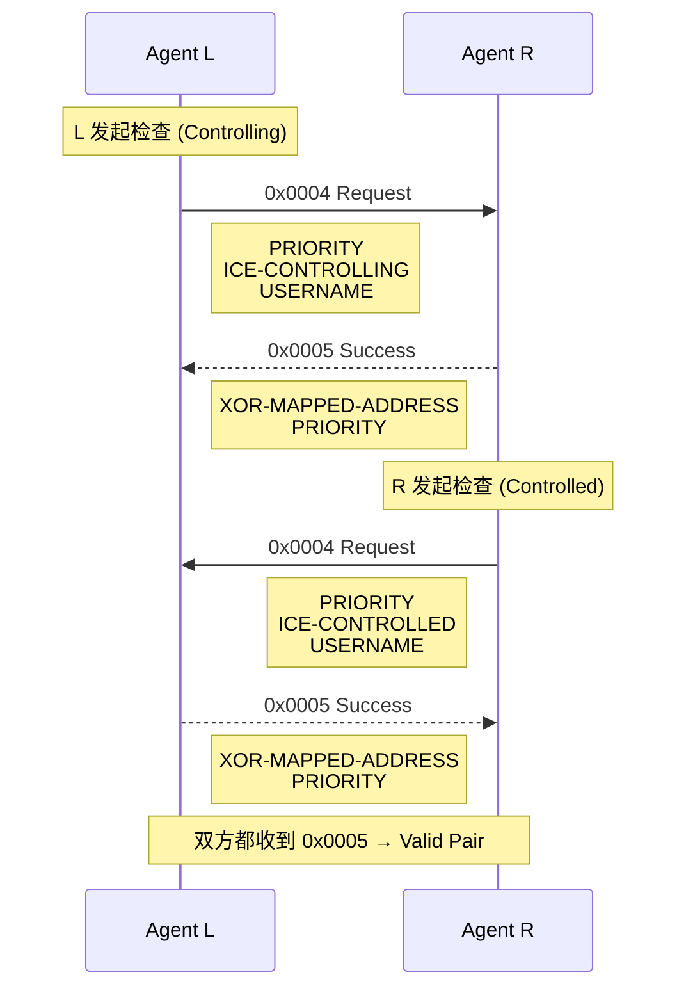
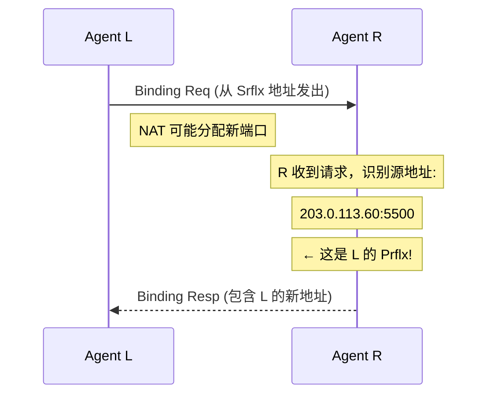

# ICE 连接性检查详解

## 一句话理解

**ICE 连接性检查 = 两端互相"敲门"验证候选对的通路**

---

## 候选对 (Candidate Pair)

交换候选列表后，双方开始配对测试。

| 术语 | 说明 |
|------|------|
| **Candidate Pair** | 本地候选 + 远程候选的配对 |
| **本地候选** | 我方的候选地址 |
| **远程候选** | 对方的候选地址 |

**示例**：A 有 3 个候选，B 有 4 个候选 → 最多 12 个候选对

```
Agent A                    Agent B
   │                          │
   │  候选列表:                │  候选列表:
   │  ├─ Host: 192.168.1.100  │  ├─ Host: 10.0.0.50
   │  ├─ Srflx: 203.0.113.50  │  ├─ Srflx: 198.51.100.30
   │  └─ Relay: 198.51.100.5  │  └─ Relay: 192.0.2.15
   │                          │
   ▼                          ▼
   候选对 (最多 3×3 = 9 对)
```

---

## STUN Message Type Flag 详解

### Flag 结构

STUN 消息类型 = **方法(12bit) + 类(2bit)**：

```
┌─────────────────────────────────────────────────────┐
│  16bit = [方法 12bit] [C1 1bit] [C0 1bit]            │
├─────────────────────────────────────────────────────┤
│  C1 C0: 00=请求, 01=成功响应, 10=指示, 11=错误         │
└─────────────────────────────────────────────────────┘
```

### M11-M0 详解

**M11-M0** 表示方法字段的 **12 个位**（bit 13 到 bit 2）：

```
 16bit Message Type:

 ┌────┬────────────────────────────────────────────────┬────┐
 │ 00 │ M11  M10  M9   M8   M7   M6   M5   M4  M3  M2  M1  M0 │ C1 │ C0 │
 ├────┴──────────── 方法 (Method) 12 bits ────────────────┴────┴────┤
 │ 预留│                                                │ 类别 │
 │ (必须为 00)                                           │(2 bits)│
 └─────────────────────────────────────────────────────────────┘

 完整结构: [00][M11-M0 (12 bits)][C1-C0 (2 bits)]
              ↑↑
           预留位
```

| 字段 | 位数 | 说明 |
|------|------|------|
| **前 2 位 (预留)** | 2 bits | 必须为 00，用于区分 STUN 和其他协议 |
| **M11-M0** | 12 bits | 方法（Method），表示操作类型 |
| **C1-C0** | 2 bits | 类别（Class），表示消息方向 |

### 实际分解示例

| 消息 | Type (Hex) | M11-M0 (二进制) | M11-M0 (十六进制) | C1 | C0 | 含义 |
|------|------------|-----------------|-------------------|----|----|------|
| Binding Request | `0x0004` | `0000 0000 0001` | `0x001` | 0 | 0 | 方法=Binding，类别=请求 |
| Binding Success | `0x0005` | `0000 0000 0001` | `0x001` | 0 | 1 | 方法=Binding，类别=成功 |
| Binding Indication | `0x0006` | `0000 0000 0001` | `0x001` | 1 | 0 | 方法=Binding，类别=指示 |
| Binding Error | `0x0007` | `0000 0000 0001` | `0x001` | 1 | 1 | 方法=Binding，类别=错误 |

---

## STUN 消息格式

### 完整消息结构

```
┌─────────────────────────────────────────────────────────┐
│  STUN 头 (20 字节)                                       │
├─────────────────────────────────────────────────────────┤
│  | 类型 (16bit) | 长度 (16bit) |   Magic Cookie (32bit)  │
│  |              Transaction ID (96bit)                  │
├─────────────────────────────────────────────────────────┤
│  属性 1 (TLV)                                            │
├─────────────────────────────────────────────────────────┤
│  属性 2 (TLV)                                            │
├─────────────────────────────────────────────────────────┤
│  ...                                                    │
└─────────────────────────────────────────────────────────┘
```

### 头部结构详解

```
 0                   1                   2                   3
 0 1 2 3 4 5 6 7 8 9 0 1 2 3 4 5 6 7 8 9 0 1 2 3 4 5 6 7 8 9 0 1
+-+-+-+-+-+-+-+-+-+-+-+-+-+-+-+-+-+-+-+-+-+-+-+-+-+-+-+-+-+-+-+-+
|0 0|     STUN Message Type     |         Message Length        |
+-+-+-+-+-+-+-+-+-+-+-+-+-+-+-+-+-+-+-+-+-+-+-+-+-+-+-+-+-+-+-+-+
|                         Magic Cookie (0x2112A442)             |
+-+-+-+-+-+-+-+-+-+-+-+-+-+-+-+-+-+-+-+-+-+-+-+-+-+-+-+-+-+-+-+-+
|                                                               |
|                     Transaction ID (96 bits)                  |
|                                                               |
+-+-+-+-+-+-+-+-+-+-+-+-+-+-+-+-+-+-+-+-+-+-+-+-+-+-+-+-+-+-+-+-+
```

### 头部字段说明

| 字段 | 长度 | 说明 |
|------|------|------|
| **Message Type** | 16 bits | 消息类型：[00][M11-M0][C1-C0]，前 2 位必须为 00 |
| **Message Length** | 16 bits | 属性总长度（不含头部 20 字节） |
| **Magic Cookie** | 32 bits | 固定值 `0x2112A442`，用于协议识别和 XOR 混淆 |
| **Transaction ID** | 96 bits | 随机数，用于关联请求和响应 |

### Magic Cookie 详解

Magic Cookie (`0x2112A442`) 有两个核心作用：

#### 作用一：协议识别

STUN 运行在 UDP/TCP 上，和 RTP、RTCP 等协议共用端口。Magic Cookie 用于区分 STUN：

```
收到 UDP 包
    │
    ▼
检查 Magic Cookie = 0x2112A442？
    │
    ├─ 是 → STUN 消息
    └─ 否 → 其他协议
```

#### 作用二：XOR 编码

混淆地址字段，防止 NAT ALG 误改：

| 数据 | 长度 | Magic Cookie 使用方式 |
|------|------|---------------------|
| IPv4 地址 | 4 bytes | 全部 4 bytes XOR |
| IPv6 地址 | 16 bytes | 4 bytes 重复 XOR |
| Port | 2 bytes | 高 2 bytes (0x2112) XOR |

```
Port = 4000 (0x0FA0)
0x0FA0 XOR 0x2112 = 0x21B2
```

---

## 连接性检查流程

### 步骤一：双方互发 Binding Request (4-way Handshake)



### Binding Request (连接性检查) 完整数据包

```
┌────────────────────────────────────────────────────────────────────────┐
│ STUN Header (20 bytes)                                                 │
├────────────────────────────────────────────────────────────────────────┤
│ Byte 0-1:   Type = 0x0004 (Binding Request)                            │
│ Byte 2-3:   Length = 属性总长度                                         │
│ Byte 4-7:   Magic Cookie = 0x2112A442                                  │
│ Byte 8-19:  Transaction ID = 96-bit 随机数                              │
├────────────────────────────────────────────────────────────────────────┤
│ Attributes (按顺序排列):                                                │
│ ├─ USERNAME (0x0006)                                                   │
│ │     Type=0x0006, Length=用户名长度                                    │
│ │     Value: "user1:user2" (双方用户名片段)                              │
│ ├─ PRIORITY (0x0024)                                                   │
│ │     Type=0x0024, Length=0x0004                                       │
│ │     Value: 32-bit 候选优先级                                          │
│ ├─ ICE-CONTROLLING (0x8029) 或 ICE-CONTROLLED (0x802A)                 │
│ │     Type=0x8029/0x802A, Length=0x0008                                │
│ │     Value: 64-bit Tiebreaker                                         │
│ ├─ USE-CANDIDATE (0x0025) [控制方提名时]                                │
│ │     Type=0x0025, Length=0x0000 (flag only)                           │
│ ├─ MESSAGE-INTEGRITY (0x0008)                                          │
│ │     Type=0x0008, Length=0x0014                                       │
│ │     Value: 20-byte HMAC-SHA1                                         │
│ └─ FINGERPRINT (0x8028) [可选]                                         │
│       Type=0x8028, Length=0x0004                                       │
│       Value: CRC32                                                     │
└────────────────────────────────────────────────────────────────────────┘
```

### Binding Response 完整数据包

```
┌────────────────────────────────────────────────────────────────────────┐
│ STUN Header (20 bytes)                                                 │
├────────────────────────────────────────────────────────────────────────┤
│ Byte 0-1:   Type = 0x0005 (Binding Success)                            │
│ Byte 2-3:   Length = 属性总长度                                         │
│ Byte 4-7:   Magic Cookie = 0x2112A442                                  │
│ Byte 8-19:  Transaction ID = 与 Request 匹配                            │
├────────────────────────────────────────────────────────────────────────┤
│ Attributes:                                                            │
│ ├─ XOR-MAPPED-ADDRESS (0x0020)                                         │
│ │     Type=0x0020, Length=0x0008                                       │
│ │     Value: 对端反射地址 (XOR 编码)                                     │
│ │     - Port = 源端口 XOR 0x2112                                        │
│ │     - IP = 源 IP XOR 0x2112A442                                      │
│ ├─ PRIORITY (0x0024)                                                   │
│ │     Type=0x0024, Length=0x0004                                       │
│ │     Value: 对端收到的候选优先级                                         │
│ ├─ ICE-CONTROLLED (0x802A) [被控方回复时]                                │
│ │     Type=0x802A, Length=0x0008                                       │
│ │     Value: Tiebreaker                                                │
│ ├─ USE-CANDIDATE (0x0025) [提名确认时]                                  │
│ │     Type=0x0025, Length=0x0000 (flag only)                           │
│ ├─ MESSAGE-INTEGRITY (0x0008)                                          │
│ │     Type=0x0008, Length=0x0014                                       │
│ │     Value: HMAC-SHA1                                                 │
│ └─ FINGERPRINT (0x8028)                                                │
│       Type=0x8028, Length=0x0004                                       │
│       Value: CRC32                                                     │
└────────────────────────────────────────────────────────────────────────┘
```


### 步骤二：Peer-Reflexive 发现

连接性检查过程中可能发现 **Peer-Reflexive (Prflx) 候选**。



**Prflx 优先级高于 Srflx**，会自动加入候选列表。

---

## ICE 连接性检查 TLV 详解

### XOR-MAPPED-ADDRESS 属性详解

**Type**: `0x0020` | **Length**: IPv4=8 字节, IPv6=20 字节

```
 0                   1                   2                   3
 0 1 2 3 4 5 6 7 8 9 0 1 2 3 4 5 6 7 8 9 0 1 2 3 4 5 6 7 8 9 0 1
+-+-+-+-+-+-+-+-+-+-+-+-+-+-+-+-+-+-+-+-+-+-+-+-+-+-+-+-+-+-+-+-+
|0x0020 (XOR-MAPPED-ADDRESS)    |         Length = 8/20         |
+-+-+-+-+-+-+-+-+-+-+-+-+-+-+-+-+-+-+-+-+-+-+-+-+-+-+-+-+-+-+-+-+
|    Family     |           Port (XOR)        |                 |
+-+-+-+-+-+-+-+-+-+-+-+-+-+-+-+-+-+-+-+-+-+-+-+-+-+-+-+-+-+-+-+-+
|                                                               |
|                    Address (XOR)                              |
|                                                               |
|                                                               |
|                                                               |
+-+-+-+-+-+-+-+-+-+-+-+-+-+-+-+-+-+-+-+-+-+-+-+-+-+-+-+-+-+-+-+-+
```

**XOR 编码公式：**
- Port = 原始端口 XOR Magic Cookie 高 16 位 (0x2112)
- Address = 原始 IP XOR Magic Cookie (0x2112A442)

**示例**：
```
原始: 203.0.113.50:4000
Port: 4000 XOR 0x2112 = 0x0FA0 XOR 0x2112 = 0x21B2
IP:   203.0.113.50 XOR 0x2112A442 = 计算结果
```

### PRIORITY 属性详解

**Type**: `0x0024` | **Length**: 4 字节

```
 0                   1                   2                   3
 0 1 2 3 4 5 6 7 8 9 0 1 2 3 4 5 6 7 8 9 0 1 2 3 4 5 6 7 8 9 0 1
+-+-+-+-+-+-+-+-+-+-+-+-+-+-+-+-+-+-+-+-+-+-+-+-+-+-+-+-+-+-+-+-+
|0x0024 (PRIORITY)                |         Length = 4          |
+-+-+-+-+-+-+-+-+-+-+-+-+-+-+-+-+-+-+-+-+-+-+-+-+-+-+-+-+-+-+-+-+
|                                                               |
|                    Priority (32 bits)                         |
|                                                               |
+-+-+-+-+-+-+-+-+-+-+-+-+-+-+-+-+-+-+-+-+-+-+-+-+-+-+-+-+-+-+-+-+
```

**优先级计算公式：**
```
priority = (2^24) × type_preference +
           (2^8) × local_preference +
           (2^0) × (256 - component_id)
```

### Binding Indication (保活)

```
┌─────────────────────────────────────────────────────────────┐
│  STUN Header (20 bytes)                                     │
│  ├─ Type: 0x0006 (Binding Indication)                       │
│  ├─ Magic Cookie: 0x2112A442                                │
│  └─ Transaction ID: 随机（无响应）                            │
├─────────────────────────────────────────────────────────────┤
│  Attributes:                                                │
│  └─ (空，仅用于保活，不做响应)                                 │
└─────────────────────────────────────────────────────────────┘
```

---

## 连接性检查 TLV 属性

> **注意**：以下内容移至单独文档：
> - 候选对状态机 → [[wiki/tutorials/tutorial-ice-nomination]]
> - ICE 会话状态、定时参数 → [[wiki/tutorials/tutorial-ice-nomination]]

### 连接性检查/提名相关属性速查

| 属性名 | Type (Hex) | 类别 | 长度 | 用途 |
|--------|-----------|------|------|------|
| `USERNAME` | `0x0006` | 必须 | 可变 | 交换的用户名片段 |
| `PRIORITY` | `0x0024` | 必须 | 4 字节 | 候选优先级 |
| `USE-CANDIDATE` | `0x0025` | 可选 | 0 字节 | 提名标志（flag） |
| `ICE-CONTROLLING` | `0x8029` | 必须 | 8 字节 | 控制方 + Tiebreaker |
| `ICE-CONTROLLED` | `0x802A` | 必须 | 8 字节 | 被控方 + Tiebreaker |

---

## 一句话总结

> **Flag 变化 = 0x0004(Request) ↔ 0x0005(Success)**
>
> **连接性检查 = 4-way handshake 验证候选对，发现 Prflx**
>
> **结果 = Valid Pair 用于后续提名 + Binding Indication 保活**
>
> **连接性检查 = 4-way handshake 验证候选对，发现 Prflx**
>
> **提名 = Controlling Agent 用 USE-CANDIDATE 选择最优路径**
>
> **结果 = Selected Pair 用于媒体传输 + Binding Indication 保活**

---

## 相关链接

- [[wiki/tutorials/tutorial-udp-hole-punching]] - UDP 打洞流程详解（连通性检查 = 标准化打洞）
- [[wiki/tutorials/tutorial-ice-candidate-gathering]] - 候选收集流程
- [[wiki/tutorials/tutorial-ice-nomination]] - 提名流程详解
- [[wiki/concepts/concept-ice]] - ICE 通俗理解
- [[wiki/protocols/protocol-rfc8445]] - ICE RFC 8445 协议分析
- [[wiki/protocols/protocol-rfc5389]] - STUN RFC 5389 协议分析
- [[raw/rfcs/rfc8445]] - RFC 8445 英文原文
