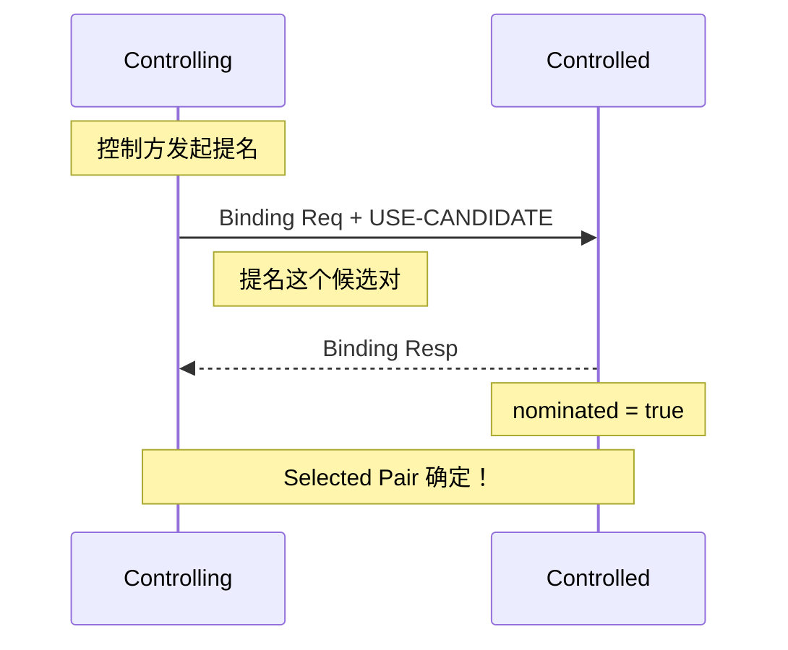
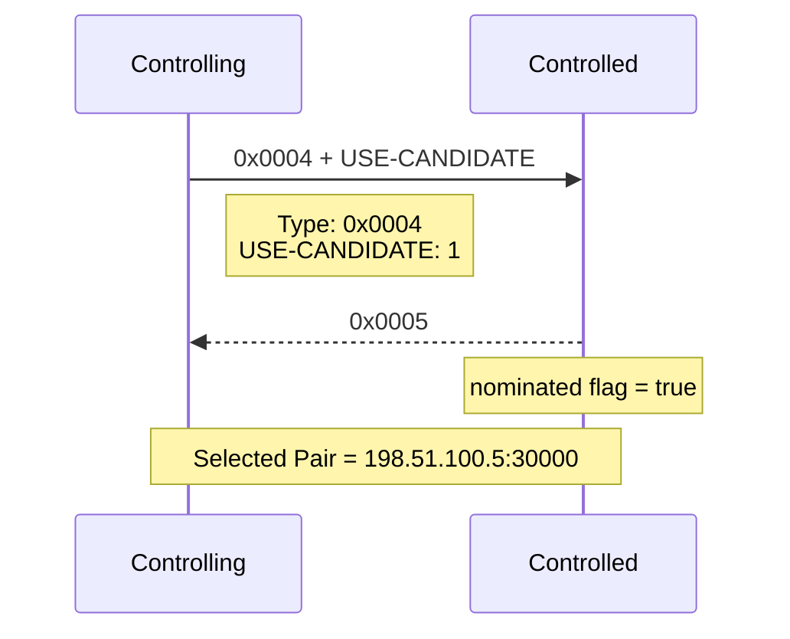
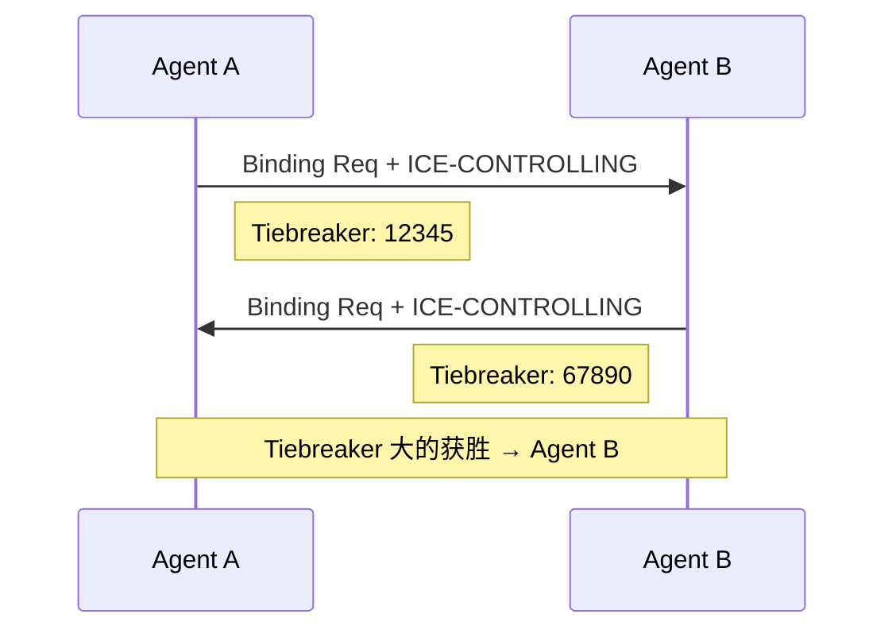
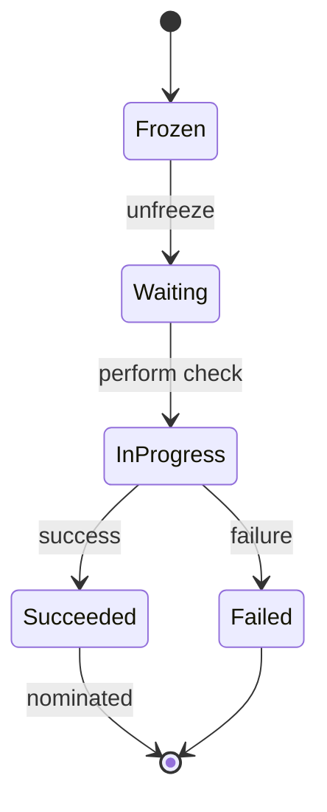
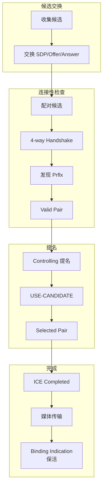

# ICE 提名流程详解

## 一句话理解

**ICE 提名 = Controlling Agent 从有效候选对中选择最优的一对，作为最终通信通道**

---

## 为什么需要提名？

### 问题：候选对可能有多个有效

连接性检查后，**可能有多对候选都通过了验证**：

```
候选对验证结果:
  ├─ Host ↔ Host    ✓ (本地直连)
  ├─ Host ↔ Srflx   ✓ (经过 NAT)
  └─ Relay ↔ Relay  ✓ (经过 TURN)

那么用哪一对来传输数据？
```

### 提名流程的作用

**提名 = Controlling Agent 从有效候选对中挑选"最优"的一对作为最终通道**

```
┌─────────────────────────────────────────────────────────────┐
│  没有提名: 两端可能选不同的路径                               │
├─────────────────────────────────────────────────────────────┤
│  A 选 Host↔Host                                              │
│  B 选 Relay↔Relay                                             │
│  → 双方选的路不一样，通信失败！                               │
└─────────────────────────────────────────────────────────────┘

┌─────────────────────────────────────────────────────────────┐
│  有提名: 控制方统一指定                                       │
├─────────────────────────────────────────────────────────────┤
│  Controlling Agent 说: "用 Relay↔Relay"                      │
│  → 双方统一走这条路，确定通信                                │
└─────────────────────────────────────────────────────────────┘
```

### 提名 vs 不提名的对比

| 场景 | 无提名 | 有提名 |
|------|--------|--------|
| **结果** | 两端自选，可能不一致 | 控制方指定，必然一致 |
| **可靠性** | 可能失败 | 必定成功 |
| **复杂性** | 需协调 | 只需控制方决定 |

---

## Controlling vs Controlled 角色

### 为什么需要区分角色？

WebRTC 通信双方是对等关系，**必须有一个"决策者"**，否则：

```
┌─────────────────────────────────────────────────────────────┐
│  没有角色区分会怎样？                                         │
├─────────────────────────────────────────────────────────────┤
│  A: "这条路径最快，用 Host↔Host"                             │
│  B: "这条路径最稳定，用 Relay↔Relay"                        │
│  → 双方各执己见，永远无法统一                                 │
└─────────────────────────────────────────────────────────────┘
```

### 角色定义

| 角色 | 英文 | 含义 | 职责 |
|------|------|------|------|
| **控制方** | Controlling Agent | 主导提名决策 | 决定用哪对候选 |
| **被控方** | Controlled Agent | 服从控制方决定 | 不参与提名决策 |

### ==如何决定谁是控制方？==

**ICE RFC 规定**：

| 场景 | 控制方 | 说明 |
|------|--------|------|
| **Offerer** | 通常是 Controlling | 发起连接的端 |
| **Answerer** | 通常是 Controlled | 响应连接的端 |

```
WebRTC 通话:
  Caller (Offerer)     Answerer
      │                    │
      ├── 发起 Offer ──────▶│  Caller = Controlling
      │◀─── 响应 Answer ────┤  Answerer = Controlled
```

### 角色在连接性检查中的体现

```
┌─────────────────────────────────────────────────────────────┐
│  Binding Request 中的角色标识                                 │
├─────────────────────────────────────────────────────────────┤
│  Controlling Agent 发送:                                      │
│  └─ ICE-CONTROLLING (0x8029) + Tiebreaker                   │
│                                                             │
│  Controlled Agent 发送:                                      │
│  └─ ICE-CONTROLLED (0x802A) + Tiebreaker                    │
└─────────────────────────────────────────────────────────────┘
```

### 冲突解决：Tiebreaker

极端情况下双方可能同时认为自己是控制方，用 **64 位 Tiebreaker** 解决：

```
┌─────────────────────────────────────────────────────────────┐
│  Tiebreaker 机制                                            │
├─────────────────────────────────────────────────────────────┤
│  双方各自生成随机 64 位 Tiebreaker                           │
│  值大的胜出                                                   │
│                                                             │
│  A: Tiebreaker = 0x8000... (大) → Controlling               │
│  B: Tiebreaker = 0x1000... (小) → Controlled                │
└─────────────────────────────────────────────────────────────┘
```

### 角色与提名的关系

```
┌─────────────────────────────────────────────────────────────┐
│                    提名流程中的角色                           │
├─────────────────────────────────────────────────────────────┤
│                                                              │
│  Controlling Agent                    Controlled Agent        │
│        │                                      │              │
│        │  1. 收集候选 ✓                       │  1. 收集候选 ✓
│        │  2. 发起连接性检查 ✓                 │  2. 响应连接性检查 ✓
│        │  3. 选最优候选对 ─────────────────▶│  3. 确认提名
│        │  4. 发送 USE-CANDIDATE             │              │
│        │  5. 指定 Selected Pair            │              │
│                                                              │
│  提名权归属 Controlling Agent                                │
└─────────────────────────────────────────────────────────────┘
```

---

## 提名流程详解

### Regular Nomination

RFC 8445 只支持 **Regular Nomination**（旧版 RFC 5245 中的 Aggressive Nomination 已被移除）：

| 类型 | RFC 5245 (旧) | RFC 8445 (新) |
|------|---------------|---------------|
| Regular Nomination | 支持 | **支持** |
| Aggressive Nomination | 支持 | **已移除** |

### 提名流程图



### 提名时 Flag 变化



### 提名请求 Binding Request (带 USE-CANDIDATE)

```
┌────────────────────────────────────────────────────────────────────────┐
│ STUN Header (20 bytes)                                                │
├────────────────────────────────────────────────────────────────────────┤
│ Byte 0-1:   Type = 0x0004 (Binding Request)                         │
│ Byte 2-3:   Length = 属性总长度                                       │
│ Byte 4-7:   Magic Cookie = 0x2112A442                               │
│ Byte 8-19:  Transaction ID = 96-bit 随机数                          │
├────────────────────────────────────────────────────────────────────────┤
│ Attributes:                                                           │
│ ├─ USERNAME (0x0006): 对方用户名片段                                  │
│ ├─ PRIORITY (0x0024): 候选优先级                                     │
│ ├─ ICE-CONTROLLING (0x8029): 控制方标志 + Tiebreaker                 │
│ ├─ USE-CANDIDATE (0x0025): ★ 提名标志                                │
│ │     Type=0x0025, Length=0x0000 (flag only)                        │
│ ├─ MESSAGE-INTEGRITY (0x0008): HMAC-SHA1                            │
│ └─ FINGERPRINT (0x8028): CRC32                                     │
└────────────────────────────────────────────────────────────────────────┘
```

**提名确认 Response**：

```
┌────────────────────────────────────────────────────────────────────────┐
│ STUN Header (20 bytes)                                                │
├────────────────────────────────────────────────────────────────────────┤
│ Byte 0-1:   Type = 0x0005 (Binding Success)                         │
│ Byte 2-3:   Length = 属性总长度                                       │
│ Byte 4-7:   Magic Cookie = 0x2112A442                               │
│ Byte 8-19:  Transaction ID = 与 Request 匹配                         │
├────────────────────────────────────────────────────────────────────────┤
│ Attributes:                                                           │
│ ├─ XOR-MAPPED-ADDRESS (0x0020): 对端反射地址                         │
│ ├─ PRIORITY (0x0024): 对端收到的优先级                               │
│ ├─ ICE-CONTROLLED (0x802A): 被控方标志                               │
│ ├─ USE-CANDIDATE (0x0025): ★ 提名确认 ← nominated=true              │
│ ├─ MESSAGE-INTEGRITY (0x0008): HMAC-SHA1                            │
│ └─ FINGERPRINT (0x8028): CRC32                                      │
└────────────────────────────────────────────────────────────────────────┘
```

### 提名过程

```
┌─────────────────────────────────────────────────────────────┐
│                    提名过程                                   │
├─────────────────────────────────────────────────────────────┤
│                                                              │
│  1. Controlling Agent 选择最优候选对                          │
│     (通常是优先级最高的 Valid Pair)                           │
│                                                              │
│  2. 发送 Binding Request + USE-CANDIDATE 标志                │
│                                                              │
│  3. Controlled Agent 收到后:                                   │
│     - 标记该候选对 nominated = true                           │
│     - 返回 Binding Success + USE-CANDIDATE                   │
│                                                              │
│  4. 该候选对成为 Selected Pair                                │
│                                                              │
│  5. 双方使用 Selected Pair 传输媒体数据                       │
│                                                              │
└─────────────────────────────────────────────────────────────┘
```

### 角色冲突处理

如果双方都声明自己是 Controlling：



**Tiebreaker 值大的 Agent 成为 Controlling。**

---

## 候选对状态机

每个候选对经历以下状态：



| 状态 | 说明 |
|------|------|
| **Frozen** | 初始状态，等待解冻 |
| **Waiting** | 等待发送检查 |
| **In-Progress** | 检查进行中 |
| **Succeeded** | 检查成功，成为 Valid Pair |
| **Failed** | 检查失败 |

---

## ICE 会话状态

| 状态 | 含义 |
|------|------|
| **Running** | ICE 正在进行中 |
| **Completed** | 找到可用路径，开始传输 |
| **Failed** | 所有路径失败，无法连接 |

---

## 定时参数

| 参数 | 默认值 | 说明 |
|------|--------|------|
| **Ta** | 50ms | STUN/TURN 事务生成间隔 |
| **RTO** | 动态计算 | 重传超时 |

---

## 完整流程图



---

## 提名相关属性速查

| 属性名 | Type (Hex) | 类别 | 长度 | 用途 |
|--------|-----------|------|------|------|
| `USE-CANDIDATE` | `0x0025` | 可选 | 0 字节 | 提名标志（flag） |
| `ICE-CONTROLLING` | `0x8029` | 必须 | 8 字节 | 控制方 + Tiebreaker |
| `ICE-CONTROLLED` | `0x802A` | 必须 | 8 字节 | 被控方 + Tiebreaker |

---

## 一句话总结

> **提名 = Controlling Agent 从多个 Valid Pair 中选择最优的一对**
>
> **角色 = Controlling (主导提名) vs Controlled (服从决定)**
>
> **USE-CANDIDATE = 提名的标志，收到后该候选对成为 Selected Pair**
>
> **状态机 = Frozen → Waiting → InProgress → Succeeded/Failed**
>
> **会话状态 = Running → Completed/Failed**

---

## 相关链接

- [[wiki/tutorials/tutorial-udp-hole-punching]] - UDP 打洞流程详解（打洞成功后的路径选择）
- [[wiki/tutorials/tutorial-ice-connectivity-checks]] - 连接性检查详解
- [[wiki/tutorials/tutorial-ice-candidate-gathering]] - 候选收集详解
- [[wiki/concepts/concept-ice]] - ICE 通俗理解
- [[wiki/protocols/protocol-rfc8445]] - ICE RFC 8445 协议分析
